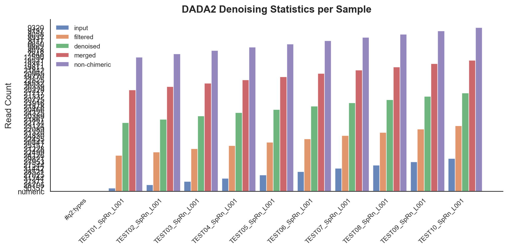
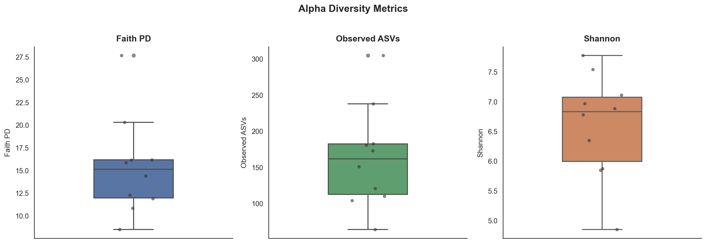
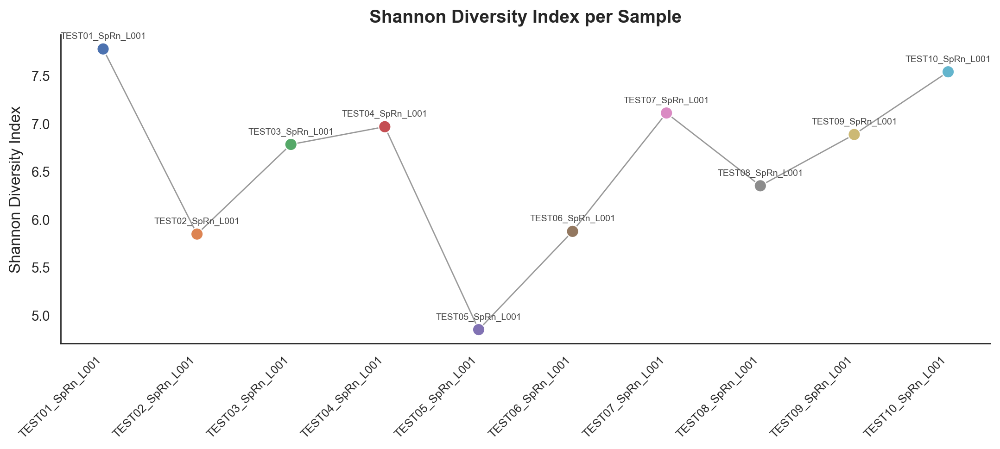
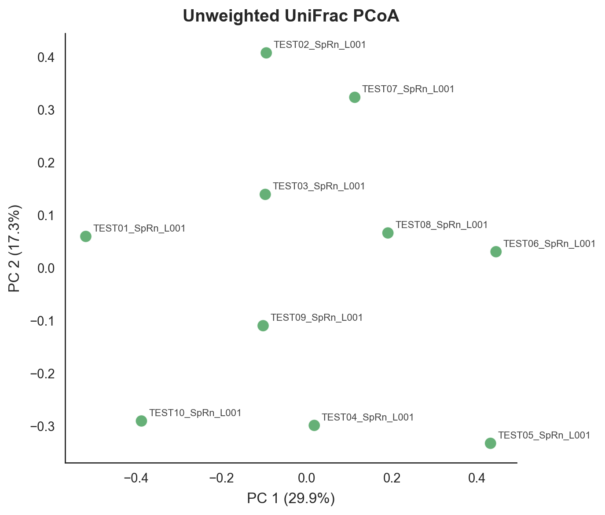
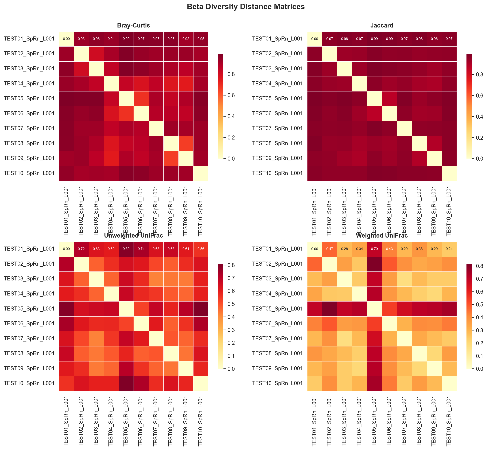
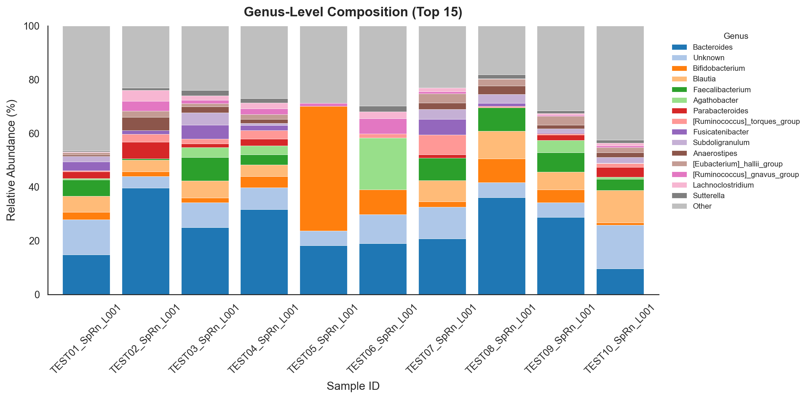

```
 ███████╗███████╗ ██████╗ ██████╗
 ██╔════╝██╔════╝██╔═══██╗╚════██╗
 ███████╗█████╗  ██║   ██║  ██╔═╝
 ╚════██║██╔══╝  ██║▄▄ ██║ ██╔╝
 ███████║███████╗╚██████╔╝██████╗
 ╚══════╝╚══════╝ ╚══▀▀═╝ ╚═════╝
 ██████╗ ██╗██████╗ ███████╗
 ██╔══██╗██║██╔══██╗██╔════╝
 ██████╔╝██║██████╔╝█████╗
 ██╔═══╝ ██║██╔═══╝ ██╔══╝
 ██║     ██║██║     ███████╗
 ╚═╝     ╚═╝╚═╝     ╚══════╝
      sequence -> pipeline
```

> **ローカル LLM で QIIME2 マイクロバイオーム解析を自動化 — オフライン・API キー不要・オープンソース**

---

## 日本語 | [English](#english)

---

## これは何？

**seq2pipe** は、あなたの PC で動くローカル AI エージェントです。
生の FASTQ データを渡すだけで、QIIME2 解析パイプラインの**設計・実行・Python 解析・図の修正・レポート生成**まで自動で行います。

- **起動時に日本語 / 英語を選択**し、以降の AI 応答・レポートを統一
- 起動時に Python 依存パッケージ（numpy / pandas 等）の存在を自動確認
- データ構造を自動で調査（FASTQ / メタデータ / 既存 QZA）
- データに合った QIIME2 コマンドをゼロから組み立てる
- すぐ実行できる `.sh` / `.ps1` スクリプトを書き出す
- **2 つの操作モード**: チャット（自然言語でやりたい解析を指定）・自律エージェント（AI が自律的に全解析を設計・実行）
- **3 ステップ自動解析パイプライン（`--auto` モード）**:
  - **STEP 1**: QIIME2 パイプライン（DADA2 デノイジング → 系統樹 → 多様性解析 → 分類学的解析）
  - **STEP 2**: 決定論的包括解析（`analysis.py`）— LLM に依存せず **15 種類の出版品質 PNG 図を確実に生成**
  - **STEP 3**: HTML レポート自動生成
- **ツール呼び出し型コード生成エージェント（vibe-local 方式）**: LLM がまず `read_file` でデータの列名・形式を確認してからコードを生成するため精度が高く、エラーが出ても `NEVER GIVE UP` で自動修正を繰り返す
- **解析後の振り返り・修正モード**: 生成された図に対して「色を変えて」「凡例を外に出して」など自然言語で修正を指示し、LLM が自動でコードを修正・再実行
- QIIME2 の出力を **Python（pandas / scipy / scikit-learn / matplotlib / seaborn）で高度解析**
- 解析図をすべて **PNG として自動保存**（PDF/SVG が出力された場合も macOS 内蔵 `sips` で自動変換）
- **メタデータなしでも多様性解析を実行**: メタデータファイル不要で α 多様性・β 多様性を自動計算
- **`--classifier` オプション**: SILVA 138 分類器の自動探索・指定による分類学的解析
- 解析終了後に **HTML レポートを自動生成**（`--auto` モード）、またはチャットモードで「レポート」→ HTML / 「PDF」→ LaTeX/PDF

すべて **あなたのマシン上** で完結。クラウドや有料 API は一切使いません。

---

## デモ出力 — 実際の解析結果

ヒト便検体 10 サンプル（TEST01〜TEST10、凍結乾燥便、Illumina MiSeq ペアエンド V3-V4）を seq2pipe で解析した実際の出力です。
すべて `analysis.py`（STEP 2）が決定論的に自動生成した PNG 図です。

### DADA2 デノイジング統計



### α 多様性 — Shannon / Faith PD / Observed ASVs



### Shannon 多様性（サンプル別ストリッププロット）



### β 多様性 — Bray-Curtis PCoA


### β 多様性 — Unweighted UniFrac PCoA



### β 多様性 — 距離行列ヒートマップ（4 指標）



### 分類組成 — 属レベル積み上げ棒グラフ



### 分類組成 — 属レベルヒートマップ


> 上記を含む全 15 図は `--auto` モードで自動生成され、HTML レポートにまとめられます。

---

## 必要なもの

| | macOS | Linux | Windows |
|---|---|---|---|
| Python | 3.9 以上 | 3.9 以上 | 3.9 以上 |
| Ollama | `setup.sh` で自動 | `setup.sh` で自動 | `setup.bat` で自動 |
| QIIME2 | conda 環境（推奨）または Docker | conda 環境または Docker Engine | Docker Desktop |
| Docker | 任意（QIIME2 conda env があれば不要） | 任意 | Docker Desktop |
| Python 解析パッケージ | QIIME2 conda env に含まれる | QIIME2 conda env に含まれる | 手動 pip |
| RAM | 8 GB 以上推奨 | 8 GB 以上推奨 | 8 GB 以上推奨 |
| ディスク | 約 10 GB（LLM + QIIME2） | 約 10 GB | 約 10 GB |

**Python 解析パッケージ**（`setup.sh` が自動インストール）:
`numpy`, `pandas`, `matplotlib`, `seaborn`, `scipy`, `scikit-learn`, `biom-format`, `networkx`, `statsmodels`

---

## インストール（3 ステップ）

### macOS

```bash
git clone https://github.com/Rhizobium-gits/seq2pipe.git
cd seq2pipe
chmod +x setup.sh launch.sh
./setup.sh      # 初回のみ（Ollama + Python パッケージ + Docker 確認）
./launch.sh     # 起動
```

### Linux（Ubuntu / Debian / Fedora / Arch など）

```bash
git clone https://github.com/Rhizobium-gits/seq2pipe.git
cd seq2pipe
chmod +x setup.sh launch.sh
./setup.sh      # 初回のみ（Docker Engine を自動インストール）
./launch.sh     # 起動
```

> Linux の場合、`setup.sh` 完了後に `newgrp docker` または再ログインが必要な場合があります。

### Windows

```
1. git clone https://github.com/Rhizobium-gits/seq2pipe.git
2. seq2pipe フォルダを開く
3. setup.bat をダブルクリック（初回のみ）
4. launch.bat をダブルクリックして起動
```

PowerShell を使う場合:

```powershell
Set-ExecutionPolicy -Scope CurrentUser -ExecutionPolicy RemoteSigned
.\setup.ps1   # 初回のみ
.\launch.ps1  # 起動
```

Windows の Python 解析パッケージは手動でインストールしてください:

```powershell
pip install numpy pandas matplotlib seaborn scipy scikit-learn biom-format networkx statsmodels
```

---

## 起動方法

```bash
./launch.sh     # macOS / Linux
.\launch.bat    # Windows
```

起動すると言語選択（日本語 / English）の後、対話型ターミナルセッションが始まります。

---

## 使い方

### モード 1 — 自然言語でリクエスト（指定解析）

```
$ ./launch.sh --fastq-dir ~/input

やりたい解析を入力: Shannon 多様性をグループ別に violin plot で比較

[list_files]  エクスポートファイル一覧を確認
[read_file]   alpha/shannon_vector.tsv の列名を確認
[write_file]  analysis.py を生成
[run_python]  EXIT CODE: 0 → figures/shannon_violin.png 保存

✅ 解析完了！

  ✏️  振り返り・修正モード
  生成された図に対して自然言語で修正を指示できます。
  例: 「積み上げ棒グラフの凡例を外に出して」
      「PCoA の点を大きくして、サンプル名を表示して」
      「色盲対応のパレットに変えて」
  📄 レポート出力:
      HTML: 「レポート」と入力
      PDF:  「PDFレポート」または「PDF」と入力
  終了: 空 Enter / quit / done

✏️  修正内容> PCoA の点を大きくしてサンプル名も表示して

[write_file] analysis.py を修正
[run_python] EXIT CODE: 0 → figures/fig10_beta_pcoa.png 更新

✏️  修正内容> PDF

📐 PDF レポートを生成しています（LaTeX）...
📐 LaTeX エンジン検出: lualatex
✅ PDF レポート生成完了！
📄 ファイル: /path/to/results/report.pdf
```

### モード 2 — 完全自律（--auto）

FASTQ ディレクトリを指定するだけで、QIIME2 パイプライン + 決定論的解析 + レポートまで自動実行します。

```bash
cd ~/seq2pipe
./launch.sh --fastq-dir ~/input --auto
```

```
  🚀 STEP 1/3: QIIME2 パイプライン実行中
    -> dada2 denoise-paired, phylogeny, diversity, taxonomy...
  ✅ パイプライン完了

  📊 STEP 2/3: 包括的解析（analysis.py）
    fig01 DADA2 デノイジング統計        ✅
    fig02 シーケンシング深度            ✅
    fig03 α多様性（Shannon/Faith PD/Observed ASVs）  ✅
    fig04 Shannon 多様性（サンプル別）     ✅
    fig05 PCoA Bray-Curtis              ✅
    fig06 PCoA Jaccard                  ✅
    fig07 PCoA Unweighted UniFrac       ✅
    fig08 PCoA Weighted UniFrac         ✅
    fig09 β多様性距離ヒートマップ        ✅
    fig10 Top 30 ASV ヒートマップ        ✅
    fig11 α多様性相関                   ✅
    fig12 ASV リッチネス vs 深度         ✅
    fig13 属レベル組成                   ✅
    fig14 門レベル組成                   ✅
    fig15 属レベルヒートマップ            ✅
  ✅ 15 図を生成しました

  📄 STEP 3/3: HTML レポート生成
  ✅ レポート完了
```

### DADA2 パラメータの自動検出

`--auto` フラグ使用時、リード長から DADA2 パラメータを自動検出します:

```bash
./launch.sh --fastq-dir ~/input --auto
# → trunc_len_f, trunc_len_r, sampling_depth を自動推定

# 手動上書きも可能
./launch.sh --fastq-dir ~/input --auto \
  --trim-left-f 20 --trim-left-r 20 \
  --trunc-len-f 260 --trunc-len-r 230
```

### 分類学的解析（`--classifier`）

SILVA 138 Naive Bayes 分類器を指定して分類学的解析を有効化できます:

```bash
# 自動探索（seq2pipe ディレクトリ内に分類器がある場合）
./launch.sh --fastq-dir ~/input --auto

# 明示的に指定
./launch.sh --fastq-dir ~/input --auto --classifier ~/silva-138-99-nb-classifier.qza
```

分類器が検出されると、QIIME2 パイプラインで分類学的解析が実行され、
`analysis.py` が属・門レベルの組成図（fig13〜fig15）を自動生成します。

### レポート出力

| 入力例 | 出力 |
|--------|------|
| `--auto` モード | HTML レポートを自動生成（STEP 3/3） |
| `レポート` / `html` | HTML レポート（図を base64 埋め込み、ブラウザで開く） |
| `PDF` / `PDFレポート` / `latex` | LaTeX → PDF レポート（lualatex/xelatex でコンパイル） |

### 生成されるファイル

```
~/seq2pipe_results/<タイムスタンプ>/
├── exported/                 ← QIIME2 エクスポートデータ
│   ├── feature-table.tsv
│   ├── taxonomy/taxonomy.tsv
│   ├── alpha/<指標>/alpha-diversity.tsv
│   ├── beta/<行列>/distance-matrix.tsv
│   └── denoising_stats/stats.tsv
├── figures/                  ← すべて PNG 形式で保存
│   ├── fig01_dada2_stats.png
│   ├── fig02_sequencing_depth.png
│   ├── fig03_alpha_diversity.png
│   ├── fig04_shannon_per_sample.png
│   ├── fig05_pcoa_braycurtis.png
│   ├── fig06_pcoa_jaccard.png
│   ├── fig07_pcoa_unweighted_unifrac.png
│   ├── fig08_pcoa_weighted_unifrac.png
│   ├── fig09_beta_distance_heatmaps.png
│   ├── fig10_top30_asv_heatmap.png
│   ├── fig11_alpha_correlations.png
│   ├── fig12_richness_vs_depth.png
│   ├── fig13_genus_composition.png      ← 分類器あり
│   ├── fig14_phylum_composition.png     ← 分類器あり
│   └── fig15_genus_heatmap.png          ← 分類器あり
├── report.html               ← HTML レポート（自動生成）
├── report.tex                ← LaTeX ソース（「PDF」で生成）
└── report.pdf                ← PDF レポート（lualatex/xelatex でコンパイル）
```

---

## 対応解析一覧

### QIIME2 コア解析（STEP 1）
| 解析 | コマンド |
|---|---|
| インポート・デマルチプレックス | `qiime tools import` |
| DADA2 デノイジング | `qiime dada2 denoise-paired/single` |
| 分類（SILVA 138） | `qiime feature-classifier classify-sklearn` |
| 分類組成バーチャート | `qiime taxa barplot` |
| α・β 多様性（メタデータあり） | `qiime diversity core-metrics-phylogenetic` |
| α・β 多様性（メタデータなし） | `qiime diversity alpha` / `qiime diversity beta` など個別実行 |
| 差次解析 ANCOM-BC | `qiime composition ancombc` |

### 決定論的包括解析（STEP 2 — `analysis.py`、LLM 不要）
| 図番号 | 解析内容 | パッケージ |
|---|---|---|
| fig01 | DADA2 デノイジング統計 | pandas, matplotlib |
| fig02 | シーケンシング深度（サンプル別） | pandas, matplotlib |
| fig03 | α 多様性ボックスプロット（Shannon / Faith PD / Observed ASVs） | pandas, seaborn |
| fig04 | Shannon 多様性（サンプル別ストリッププロット） | pandas, seaborn |
| fig05 | Bray-Curtis PCoA | pandas, sklearn (MDS) |
| fig06 | Jaccard PCoA | pandas, sklearn (MDS) |
| fig07 | Unweighted UniFrac PCoA | pandas, sklearn (MDS) |
| fig08 | Weighted UniFrac PCoA | pandas, sklearn (MDS) |
| fig09 | β 多様性距離ヒートマップ（4 指標 2×2） | pandas, seaborn |
| fig10 | Top 30 ASV ヒートマップ | pandas, seaborn |
| fig11 | α 多様性相関プロット | pandas, matplotlib |
| fig12 | ASV リッチネス vs シーケンシング深度 | pandas, matplotlib |
| fig13 | 属レベル積み上げ棒グラフ（分類器あり） | pandas, matplotlib |
| fig14 | 門レベル積み上げ棒グラフ（分類器あり） | pandas, matplotlib |
| fig15 | 属レベルヒートマップ（分類器あり） | pandas, seaborn |

### Python ダウンストリーム解析（LLM コード生成エージェント — モード 1）
| 解析手法 | パッケージ |
|---|---|
| α 多様性 4 指標（Shannon / Faith PD / Evenness / Observed Features） | pandas, seaborn |
| Bray-Curtis PCoA（sklearn MDS） | pandas, sklearn |
| UniFrac PCoA（unweighted / weighted） | pandas, sklearn |
| NMDS（Bray-Curtis 非計量多次元尺度法） | pandas, sklearn |
| CLR 変換 PCA（組成データ向け主成分分析） | pandas, sklearn |
| 門・属レベル stacked bar（taxonomy あり） | pandas, seaborn |
| 属レベル heatmap（taxonomy あり） | pandas, seaborn |
| サンプル相関行列 | pandas, scipy, seaborn |
| HTML / LaTeX+PDF レポート自動生成 | report_generator.py（lualatex / xelatex） |

---

## 環境変数

| 変数 | デフォルト | 説明 |
|---|---|---|
| `QIIME2_AI_MODEL` | `qwen2.5-coder:7b` | 使用する Ollama モデル |
| `SEQ2PIPE_AUTO_YES` | `0` | `1` にするとコマンド確認をスキップ（自律モード） |
| `SEQ2PIPE_MAX_STEPS` | `100` | エージェントループの最大ステップ数 |
| `SEQ2PIPE_PYTHON_TIMEOUT` | `600` | Python 実行のタイムアウト秒数 |
| `QIIME2_CONDA_BIN` | 自動検出 | QIIME2 conda 環境の bin ディレクトリ（手動指定用） |

```bash
# 例: 自律モードで起動（確認なし）
SEQ2PIPE_AUTO_YES=1 ./launch.sh

# 例: QIIME2 conda env を手動指定
QIIME2_CONDA_BIN=/opt/conda/envs/qiime2/bin ./launch.sh
```

---

## 使用モデル

| モデル | RAM | 特徴 |
|---|---|---|
| `qwen2.5-coder:7b` | 8 GB 以上 | コード生成に最適（推奨） |
| `qwen2.5-coder:3b` | 4 GB 以上 | 軽量・高速 |
| `llama3.2:3b` | 4 GB 以上 | 汎用・会話能力高め |
| `qwen3:8b` | 16 GB 以上 | 最高品質・推論能力も高い |

### 小型モデルへの対応（ロバストネス機能）

7B 以下の小型モデルでは Ollama の tool_calls フォーマットに非対応のことがあります。
seq2pipe は以下の多層フォールバック機構でこれを自動的に補います:

1. **`_parse_text_tool_calls`**: テキスト本文に埋め込まれた JSON をツール呼び出しとして解析（5 パターン対応）
2. **Auto-inject `run_python`**: `write_file` で .py ファイルを書いた直後、モデルが `run_python` を呼ぶのを待たずに自動実行
3. **ステップ 6 フォールバック**: ツール呼び出しループが 5 ステップ進まない場合は自動的に 1 ショット生成（`run_code_agent`）に切り替え
4. **繰り返し検出**: 同じ 50 文字チャンクが 4 回連続したら生成を打ち切り（無限ループ回避）

別のモデルを使うには:

```bash
QIIME2_AI_MODEL=qwen2.5-coder:3b ./launch.sh
```

---

## アーキテクチャ

```
あなた
  |
  v
[ launch.sh / cli.py ]
        |
        v
[ pipeline_runner.py ]  ←──────────────────────→  [ qiime2_agent.py ]
  QIIME2 パイプライン実行                            QIIME2 コマンド生成
  stdout → _Tee でログ収集                          (11 ツール、STEP 0〜8)
        |
        v
[ analysis.py / run_comprehensive_analysis() ]     ← STEP 2（決定論的）
  LLM 不要・15 種類の PNG 図を確実に生成
  ├── fig01-fig12: 基本解析（DADA2統計・α/β多様性・ASV・相関）
  └── fig13-fig15: 分類組成（分類器あり時のみ）
        |
        v
[ code_agent.py / run_coding_agent() ]             ← モード 1 で使用
  LLM コード生成エージェント（vibe-local 方式）
  ├── list_files / read_file / write_file / run_python / install_package
  ├── _ensure_required_imports()  plt/pd の自動補完
  ├── _convert_new_figs()         PDF/SVG → PNG 自動変換（sips）
  ├── NEVER GIVE UP: exit code ≠ 0 → write_file 修正 → run_python 再実行
  ├── run_refinement_loop()       解析後の振り返り・修正モード
  └── 実行成功 + 図生成確認 → CodeExecutionResult 返却
        |
        v
[ report_generator.py ]
  ├── generate_html_report()  HTML レポート（base64 図埋め込み）
  └── generate_latex_report() LaTeX → PDF レポート（lualatex / xelatex）
        |
        v
  Ollama (localhost:11434)  ← ローカル LLM
```

---

## トラブルシューティング

<details>
<summary>Ollama に接続できない</summary>

```bash
ollama serve
```

</details>

<details>
<summary>QIIME2 conda 環境が自動検出されない</summary>

```bash
QIIME2_CONDA_BIN=/opt/conda/envs/qiime2/bin ./launch.sh
```

自動検出される候補: `~/miniforge3/envs/qiime2*/bin`, `~/miniconda3/envs/qiime2*/bin`, `~/anaconda3/envs/qiime2*/bin`

</details>

<details>
<summary>Docker が見つからない / 起動していない</summary>

QIIME2 conda 環境が検出されている場合、Docker は不要です。

- macOS / Windows: Docker Desktop を起動してください
- Linux: `sudo systemctl start docker`

</details>

<details>
<summary>Python 解析パッケージが足りない</summary>

```bash
pip install numpy pandas matplotlib seaborn scipy scikit-learn biom-format networkx statsmodels
```

</details>

<details>
<summary>PDF レポートの LaTeX コンパイルに失敗する</summary>

`lualatex` または `xelatex` が必要です（MacTeX に含まれています）。

```bash
# macOS（推奨・約 100 MB の minimal インストール）
brew install --cask mactex-no-gui

# または MacTeX フルインストール（約 4 GB）
# https://tug.org/mactex/

# Linux（TeX Live）
sudo apt install texlive-luatex texlive-xetex texlive-lang-japanese
```

LaTeX がインストールされていない場合、`report.tex` ファイルのみ保存されます。
以下のコマンドで手動コンパイルできます:
```bash
lualatex report.tex   # 日本語対応（推奨）
xelatex  report.tex   # 代替オプション
```

</details>

<details>
<summary>図が PDF/SVG で出力される（macOS プレビューで開けない）</summary>

seq2pipe は生成された PDF/SVG を macOS 内蔵の `sips` で自動的に PNG へ変換します。
既存の PDF ファイルがある場合は以下で一括変換できます:

```bash
for f in ~/seq2pipe_results/*/figures/*.pdf; do
  sips -s format png "$f" --out "${f%.pdf}.png" && rm "$f"
done
```

</details>

<details>
<summary>モデルが重い / 応答が遅い</summary>

```bash
QIIME2_AI_MODEL=qwen2.5-coder:3b ./launch.sh
```

</details>

---

## ファイル構成

```
seq2pipe/
├── cli.py              # ターミナル エントリーポイント（虹色バナー・モード選択）
├── qiime2_agent.py     # QIIME2 パイプライン生成エージェント（11 ツール）
├── pipeline_runner.py  # QIIME2 実行ラッパー + 結果エクスポート（_Tee ログ収集）
├── analysis.py         # 決定論的包括解析モジュール（15 図、LLM 不要）
├── code_agent.py       # LLM コード生成エージェント（vibe-local 方式）
│                       #   └── run_refinement_loop()  振り返り・修正ループ
├── report_generator.py # HTML / LaTeX+PDF レポート生成
├── chat_agent.py       # 自律解析セッション管理（レガシー）
├── Figure/             # デモ出力図（実データ解析結果 15 図）
│   ├── fig01_dada2_stats.png
│   ├── fig02_sequencing_depth.png
│   ├── fig03_alpha_diversity.png
│   ├── ...
│   ├── fig14_phylum_composition.png
│   └── fig15_genus_heatmap.png
├── Paper/              # 技術レポート（TeX / PDF）
│   ├── seq2pipe_ja.tex / seq2pipe_ja.pdf
│   └── seq2pipe_en.tex / seq2pipe_en.pdf
├── launch.sh           # macOS / Linux 起動スクリプト
├── setup.sh            # macOS / Linux セットアップ
├── LICENSE             # MIT License
└── README.md           # このファイル
```

---

## Contributors

| | Name | Role |
|---|---|---|
| [@Rhizobium-gits](https://github.com/Rhizobium-gits) | Rhizobium-gits | Author |
| [@claude-bot](https://github.com/claude-bot) | Claude (Anthropic) | Co-author — design & implementation |

---

## 参考リンク

- [QIIME2 公式ドキュメント](https://docs.qiime2.org/)
- [QIIME2 View（インタラクティブ可視化）](https://view.qiime2.org)
- [QIIME2 Forum](https://forum.qiime2.org/)
- [SILVA データベース](https://www.arb-silva.de/)
- [Ollama 公式サイト](https://ollama.com/)
- [MacTeX（LaTeX for macOS）](https://tug.org/mactex/)

---

## ライセンス

- このツール: MIT License
- SILVA 138 データ: [CC BY 4.0](https://creativecommons.org/licenses/by/4.0/)
- QIIME2: BSD License

---
---

<a name="english"></a>

# English

```
 ███████╗███████╗ ██████╗ ██████╗
 ██╔════╝██╔════╝██╔═══██╗╚════██╗
 ███████╗█████╗  ██║   ██║  ██╔═╝
 ╚════██║██╔══╝  ██║▄▄ ██║ ██╔╝
 ███████║███████╗╚██████╔╝██████╗
 ╚══════╝╚══════╝ ╚══▀▀═╝ ╚═════╝
 ██████╗ ██╗██████╗ ███████╗
 ██╔══██╗██║██╔══██╗██╔════╝
 ██████╔╝██║██████╔╝█████╗
 ██╔═══╝ ██║██╔═══╝ ██╔══╝
 ██║     ██║██║     ███████╗
 ╚═╝     ╚═╝╚═╝     ╚══════╝
      sequence -> pipeline
```

> **Automate QIIME2 microbiome analysis with a local LLM — offline, no API key, open source**

[日本語](#日本語--english)

---

## What is this?

**seq2pipe** is a local AI agent that runs entirely on your own machine.
Give it your raw FASTQ data, and it automatically handles **pipeline design, execution, Python analysis, figure refinement, and report generation**.

- **Select Japanese or English at startup** — all AI responses and reports follow your choice
- Automatically checks for required Python packages (numpy / pandas / etc.) at startup
- Inspects your data structure automatically (FASTQ / metadata / existing QZA)
- Builds the right QIIME2 commands from scratch for your dataset
- Writes ready-to-run `.sh` / `.ps1` scripts
- **Two operation modes**: Chat (specify analysis in natural language) and Autonomous agent (AI designs and runs all analyses)
- **3-step automated analysis pipeline (`--auto` mode)**:
  - **STEP 1**: QIIME2 pipeline (DADA2 denoising, phylogeny, diversity, taxonomy)
  - **STEP 2**: Deterministic comprehensive analysis (`analysis.py`) — **15 publication-quality PNG figures generated reliably without LLM dependency**
  - **STEP 3**: Automatic HTML report generation
- **Tool-calling code generation agent (vibe-local style)**: LLM first calls `read_file` to understand column names and data format before writing code — far fewer format errors; if an error occurs, `NEVER GIVE UP` — it rewrites and retries until `EXIT CODE: 0`
- **Post-analysis refinement mode**: After analysis completes, instruct the LLM in natural language to refine figures ("change colors", "move legend outside") — code is automatically rewritten and re-executed
- Runs **Python downstream analysis** (pandas / scipy / scikit-learn / matplotlib / seaborn) on QIIME2 outputs
- **Auto-saves all figures as PNG** — PDF/SVG outputs are automatically converted via macOS built-in `sips`
- **Diversity analysis without metadata**: Alpha and beta diversity metrics computed automatically even without a metadata file
- **`--classifier` option**: Auto-discovery or explicit specification of SILVA 138 classifier for taxonomic analysis
- After analysis, HTML report is auto-generated in `--auto` mode; type **"report"** for HTML / **"PDF"** for LaTeX/PDF in chat mode

Everything runs **on your machine**. No cloud, no paid API, no internet required during analysis.

---

## Demo Output — Real Analysis Results

Actual output from seq2pipe on 10 human stool samples (TEST01-TEST10, freeze-dried, Illumina MiSeq paired-end V3-V4).
All figures were deterministically generated by `analysis.py` (STEP 2) as PNG.

### DADA2 Denoising Statistics


### Alpha Diversity — Shannon / Faith PD / Observed ASVs


### Shannon Diversity (Per-Sample Strip Plot)


### Beta Diversity — Bray-Curtis PCoA


### Beta Diversity — Unweighted UniFrac PCoA


### Beta Diversity — Distance Heatmaps (4 Metrics)


### Taxonomic Composition — Genus-Level Stacked Bar


### Taxonomic Composition — Genus-Level Heatmap


> All 15 figures above are auto-generated in `--auto` mode and compiled into an HTML report.

---

## Requirements

| | macOS | Linux | Windows |
|---|---|---|---|
| Python | 3.9+ | 3.9+ | 3.9+ |
| Ollama | auto via `setup.sh` | auto via `setup.sh` | auto via `setup.bat` |
| QIIME2 | conda env (recommended) or Docker | conda env or Docker Engine | Docker Desktop |
| Docker | Optional (not needed if QIIME2 conda env exists) | Optional | Docker Desktop |
| Python analysis packages | included in QIIME2 conda env | included in QIIME2 conda env | manual pip |
| RAM | 8 GB+ recommended | 8 GB+ recommended | 8 GB+ recommended |
| Disk | ~10 GB (LLM + QIIME2) | ~10 GB | ~10 GB |

**Python analysis packages** (auto-installed by `setup.sh`):
`numpy`, `pandas`, `matplotlib`, `seaborn`, `scipy`, `scikit-learn`, `biom-format`, `networkx`, `statsmodels`

---

## Install (3 steps)

### macOS

```bash
git clone https://github.com/Rhizobium-gits/seq2pipe.git
cd seq2pipe
chmod +x setup.sh launch.sh
./setup.sh      # first time only
./launch.sh     # start
```

### Linux (Ubuntu / Debian / Fedora / Arch etc.)

```bash
git clone https://github.com/Rhizobium-gits/seq2pipe.git
cd seq2pipe
chmod +x setup.sh launch.sh
./setup.sh      # first time only (auto-installs Docker Engine)
./launch.sh     # start
```

> On Linux, you may need to run `newgrp docker` or log out and back in after `setup.sh` completes.

### Windows

```
1. git clone https://github.com/Rhizobium-gits/seq2pipe.git
2. Open the seq2pipe folder
3. Double-click setup.bat (first time only)
4. Double-click launch.bat to start
```

Using PowerShell:

```powershell
Set-ExecutionPolicy -Scope CurrentUser -ExecutionPolicy RemoteSigned
.\setup.ps1   # first time only
.\launch.ps1  # start
```

Install Python packages manually on Windows:

```powershell
pip install numpy pandas matplotlib seaborn scipy scikit-learn biom-format networkx statsmodels
```

---

## Launch

```bash
./launch.sh     # macOS / Linux
.\launch.bat    # Windows
```

After launching, select your language (Japanese / English) and an interactive terminal session begins.

---

## Usage

### Mode 1 — Natural language analysis + refinement loop

```
$ ./launch.sh --fastq-dir ~/input

Enter request: Shannon diversity violin plot by group

[list_files]  scan exported directory
[read_file]   alpha/shannon_vector.tsv (check column names)
[write_file]  analysis.py
[run_python]  EXIT CODE: 0 → figures/shannon_violin.png

✅ Analysis complete!

  ✏️  Refinement mode
  Refine generated figures with natural language instructions.
  Examples: "move legend outside the plot"
            "enlarge PCoA dots and show sample names"
            "use a colorblind-friendly palette"
  📄 Reports:
      HTML: type "report"
      PDF:  type "PDF" or "latex"
  Exit: empty Enter / quit / done

✏️  Refine> enlarge dots and add sample labels to PCoA

[write_file] analysis.py (modified)
[run_python] EXIT CODE: 0 → figures/fig10_beta_pcoa.png updated

✏️  Refine> PDF

📐 Generating PDF report (LaTeX)...
📐 LaTeX engine detected: lualatex
✅ PDF report generated!
📄 File: /path/to/results/report.pdf
```

### Mode 2 — Fully autonomous (--auto)

```bash
cd ~/seq2pipe
./launch.sh --fastq-dir ~/input --auto
```

Runs the full QIIME2 pipeline + deterministic analysis (15 figures) + HTML report automatically.

### Taxonomic analysis (`--classifier`)

Enable taxonomic analysis by providing a SILVA 138 Naive Bayes classifier:

```bash
# Auto-discovery (if classifier exists in the seq2pipe directory)
./launch.sh --fastq-dir ~/input --auto

# Explicit path
./launch.sh --fastq-dir ~/input --auto --classifier ~/silva-138-99-nb-classifier.qza
```

When a classifier is detected, QIIME2 performs taxonomic classification, and
`analysis.py` generates genus/phylum composition figures (fig13-fig15).

### Output file structure

```
~/seq2pipe_results/<timestamp>/
├── exported/                  ← QIIME2 exported data
│   ├── feature-table.tsv
│   ├── taxonomy/taxonomy.tsv
│   ├── alpha/<metric>/alpha-diversity.tsv
│   ├── beta/<matrix>/distance-matrix.tsv
│   └── denoising_stats/stats.tsv
├── figures/                   ← all saved as PNG
│   ├── fig01_dada2_stats.png
│   ├── fig02_sequencing_depth.png
│   ├── fig03_alpha_diversity.png
│   ├── fig04_shannon_per_sample.png
│   ├── fig05_pcoa_braycurtis.png
│   ├── fig06_pcoa_jaccard.png
│   ├── fig07_pcoa_unweighted_unifrac.png
│   ├── fig08_pcoa_weighted_unifrac.png
│   ├── fig09_beta_distance_heatmaps.png
│   ├── fig10_top30_asv_heatmap.png
│   ├── fig11_alpha_correlations.png
│   ├── fig12_richness_vs_depth.png
│   ├── fig13_genus_composition.png      ← with classifier
│   ├── fig14_phylum_composition.png     ← with classifier
│   └── fig15_genus_heatmap.png          ← with classifier
├── report.html                ← HTML report (auto-generated)
├── report.tex                 ← LaTeX source (type "PDF")
└── report.pdf                 ← PDF report (lualatex/xelatex compiled)
```

---

## Supported analyses

### QIIME2 core (STEP 1)
| Analysis | Command |
|---|---|
| Import & demultiplex | `qiime tools import` |
| DADA2 denoising | `qiime dada2 denoise-paired/single` |
| Taxonomic classification (SILVA 138) | `qiime feature-classifier classify-sklearn` |
| Composition bar chart | `qiime taxa barplot` |
| Alpha & beta diversity (with metadata) | `qiime diversity core-metrics-phylogenetic` |
| Alpha & beta diversity (without metadata) | `qiime diversity alpha` / `qiime diversity beta` (individual) |
| Differential abundance ANCOM-BC | `qiime composition ancombc` |

### Deterministic comprehensive analysis (STEP 2 — `analysis.py`, no LLM required)
| Figure | Analysis | Packages |
|---|---|---|
| fig01 | DADA2 denoising statistics | pandas, matplotlib |
| fig02 | Sequencing depth per sample | pandas, matplotlib |
| fig03 | Alpha diversity boxplots (Shannon / Faith PD / Observed ASVs) | pandas, seaborn |
| fig04 | Shannon diversity per sample (strip plot) | pandas, seaborn |
| fig05 | Bray-Curtis PCoA | pandas, sklearn (MDS) |
| fig06 | Jaccard PCoA | pandas, sklearn (MDS) |
| fig07 | Unweighted UniFrac PCoA | pandas, sklearn (MDS) |
| fig08 | Weighted UniFrac PCoA | pandas, sklearn (MDS) |
| fig09 | Beta diversity distance heatmaps (4 metrics, 2x2) | pandas, seaborn |
| fig10 | Top 30 ASV heatmap | pandas, seaborn |
| fig11 | Alpha diversity correlation plots | pandas, matplotlib |
| fig12 | ASV richness vs sequencing depth | pandas, matplotlib |
| fig13 | Genus-level stacked bar (with classifier) | pandas, matplotlib |
| fig14 | Phylum-level stacked bar (with classifier) | pandas, matplotlib |
| fig15 | Genus-level heatmap (with classifier) | pandas, seaborn |

### Python downstream (LLM code agent — Mode 1)
| Analysis | Packages |
|---|---|
| Alpha diversity 4-panel (Shannon / Faith PD / Evenness / Observed Features) | pandas, seaborn |
| Bray-Curtis PCoA (sklearn MDS) | pandas, sklearn |
| UniFrac PCoA (unweighted / weighted) | pandas, sklearn |
| NMDS (non-metric multidimensional scaling) | pandas, sklearn |
| CLR-transformed PCA | pandas, sklearn |
| Phylum/genus stacked bar (with taxonomy) | pandas, seaborn |
| Genus-level heatmap (with taxonomy) | pandas, seaborn |
| Sample correlation matrix | pandas, scipy, seaborn |
| HTML / LaTeX+PDF report auto-generation | report_generator.py (lualatex / xelatex) |

---

## Environment variables

| Variable | Default | Description |
|---|---|---|
| `QIIME2_AI_MODEL` | `qwen2.5-coder:7b` | Ollama model to use |
| `SEQ2PIPE_AUTO_YES` | `0` | Set to `1` to skip command confirmation (autonomous mode) |
| `SEQ2PIPE_MAX_STEPS` | `100` | Maximum agent loop steps |
| `SEQ2PIPE_PYTHON_TIMEOUT` | `600` | Timeout in seconds for Python execution |
| `QIIME2_CONDA_BIN` | auto-detected | Path to QIIME2 conda env bin directory (manual override) |

---

## Models

| Model | RAM | Description |
|---|---|---|
| `qwen2.5-coder:7b` | 8 GB+ | Best for code generation (recommended) |
| `qwen2.5-coder:3b` | 4 GB+ | Lightweight and fast |
| `llama3.2:3b` | 4 GB+ | General purpose, good conversation |
| `qwen3:8b` | 16 GB+ | Highest quality, strong reasoning |

---

## Architecture

```
You
  |
  v
[ launch.sh / cli.py ]
        |
        v
[ pipeline_runner.py ]  ←──────────────────────→  [ qiime2_agent.py ]
  QIIME2 pipeline execution                         QIIME2 command generation
  stdout captured by _Tee logger                    (11 tools, STEP 0-8)
        |
        v
[ analysis.py / run_comprehensive_analysis() ]     ← STEP 2 (deterministic)
  No LLM dependency — 15 PNG figures reliably generated
  ├── fig01-fig12: Core analysis (DADA2 stats, alpha/beta, ASV, correlation)
  └── fig13-fig15: Taxonomy (when classifier is available)
        |
        v
[ code_agent.py / run_coding_agent() ]             ← Used in Mode 1
  LLM code generation agent (vibe-local style)
  ├── list_files / read_file / write_file / run_python / install_package
  ├── _convert_new_figs()    PDF/SVG → PNG auto-conversion (sips)
  ├── NEVER GIVE UP: exit ≠ 0 → rewrite → retry
  └── run_refinement_loop()  post-analysis natural-language refinement
        |
        v
[ report_generator.py ]
  ├── generate_html_report()  base64-embedded HTML report
  └── generate_latex_report() LaTeX → PDF (lualatex / xelatex)
        |
        v
  Ollama (localhost:11434)  ← Local LLM
```

---

## Troubleshooting

<details>
<summary>Cannot connect to Ollama</summary>

```bash
ollama serve
```

</details>

<details>
<summary>QIIME2 conda env not detected automatically</summary>

```bash
QIIME2_CONDA_BIN=/opt/conda/envs/qiime2/bin ./launch.sh
```

</details>

<details>
<summary>Docker not found / not running</summary>

Docker is not required if a QIIME2 conda env is detected.

- macOS / Windows: Start Docker Desktop
- Linux: `sudo systemctl start docker`

</details>

<details>
<summary>Python analysis packages missing</summary>

```bash
pip install numpy pandas matplotlib seaborn scipy scikit-learn biom-format networkx statsmodels
```

</details>

<details>
<summary>LaTeX PDF compilation fails</summary>

Install MacTeX (includes lualatex and xelatex):

```bash
# macOS — minimal install (~100 MB)
brew install --cask mactex-no-gui

# Linux
sudo apt install texlive-luatex texlive-xetex texlive-lang-japanese

# Manual compile (if auto-compile fails)
lualatex report.tex   # preferred (Japanese support)
xelatex  report.tex   # alternative
```

If no LaTeX engine is found, `report.tex` is saved for manual compilation.

</details>

<details>
<summary>Figures saved as PDF/SVG (cannot open in macOS Preview)</summary>

seq2pipe automatically converts PDF/SVG to PNG using macOS built-in `sips`.
For existing PDF files, batch-convert with:

```bash
for f in ~/seq2pipe_results/*/figures/*.pdf; do
  sips -s format png "$f" --out "${f%.pdf}.png" && rm "$f"
done
```

</details>

<details>
<summary>Model is slow / responses take too long</summary>

```bash
QIIME2_AI_MODEL=qwen2.5-coder:3b ./launch.sh
```

</details>

---

## File structure

```
seq2pipe/
├── cli.py              # Terminal entry point (rainbow banner / mode selection)
├── qiime2_agent.py     # QIIME2 pipeline generation agent (11 tools)
├── pipeline_runner.py  # QIIME2 execution wrapper + result export (_Tee logger)
├── analysis.py         # Deterministic comprehensive analysis module (15 figures, no LLM)
├── code_agent.py       # LLM code generation agent (vibe-local style)
│                       #   └── run_refinement_loop()  post-analysis refinement
├── report_generator.py # HTML and LaTeX/PDF report generation
├── chat_agent.py       # Autonomous analysis session (legacy)
├── Figure/             # Demo output figures (real data analysis results, 15 figures)
│   ├── fig01_dada2_stats.png
│   ├── fig02_sequencing_depth.png
│   ├── fig03_alpha_diversity.png
│   ├── ...
│   ├── fig14_phylum_composition.png
│   └── fig15_genus_heatmap.png
├── Paper/              # Technical report (TeX / PDF)
│   ├── seq2pipe_ja.tex / seq2pipe_ja.pdf
│   └── seq2pipe_en.tex / seq2pipe_en.pdf
├── launch.sh           # macOS / Linux launcher
├── setup.sh            # macOS / Linux setup
├── LICENSE             # MIT License
└── README.md           # This file
```

---

## Contributors

| | Name | Role |
|---|---|---|
| [@Rhizobium-gits](https://github.com/Rhizobium-gits) | Rhizobium-gits | Author |
| [@claude-bot](https://github.com/claude-bot) | Claude (Anthropic) | Co-author — design & implementation |

---

## References

- [QIIME2 Official Documentation](https://docs.qiime2.org/)
- [QIIME2 View (interactive visualization)](https://view.qiime2.org)
- [QIIME2 Forum](https://forum.qiime2.org/)
- [SILVA Database](https://www.arb-silva.de/)
- [Ollama](https://ollama.com/)
- [MacTeX (LaTeX for macOS)](https://tug.org/mactex/)

---

## License

- This tool: MIT License
- SILVA 138 data: [CC BY 4.0](https://creativecommons.org/licenses/by/4.0/)
- QIIME2: BSD License
