```
 ███████╗███████╗ ██████╗ ██████╗
 ██╔════╝██╔════╝██╔═══██╗╚════██╗
 ███████╗█████╗  ██║   ██║  ██╔═╝
 ╚════██║██╔══╝  ██║▄▄ ██║ ██╔╝
 ███████║███████╗╚██████╔╝██████╗
 ╚══════╝╚══════╝ ╚══▀▀═╝ ╚═════╝
 ██████╗ ██╗██████╗ ███████╗
 ██╔══██╗██║██╔══██╗██╔════╝
 ██████╔╝██║██████╔╝█████╗
 ██╔═══╝ ██║██╔═══╝ ██╔══╝
 ██║     ██║██║     ███████╗
 ╚═╝     ╚═╝╚═╝     ╚══════╝
      sequence -> pipeline
```

> **ローカル LLM で QIIME2 マイクロバイオーム解析を自動化 — オフライン・API キー不要・オープンソース**
>
> **Current: v1.2.0**

---

## 日本語 | [English](#english)

---

## これは何？

**seq2pipe** は、あなたの PC で動くローカル AI エージェントです。
生の FASTQ データを渡すだけで、QIIME2 解析パイプラインの**設計・実行・Python 解析・図の修正・レポート生成**まで自動で行います。

- **起動時に日本語 / 英語を選択**し、以降の AI 応答・レポートを統一
- 起動時に Python 依存パッケージ（numpy / pandas 等）の存在を自動確認
- データ構造を自動で調査（FASTQ / メタデータ / 既存 QZA）
- データに合った QIIME2 コマンドをゼロから組み立てる
- すぐ実行できる `.sh` / `.ps1` スクリプトを書き出す
- **4 つの操作モード**: 指定解析 / 自律エージェント / 対話チャット / **研究目的駆動 (manual-auto)**
- **`--manual-auto` モード（v1.2.0 新機能）**: メタデータから実験デザインを自動解析 → 40+ 種の可視化・統計解析を研究目的に合わせて全自動実行
- **3 ステップ自動解析パイプライン（`--auto` モード）**:
  - **STEP 1**: QIIME2 パイプライン（DADA2 デノイジング → 系統樹 → 多様性解析 → 分類学的解析）
  - **STEP 1.5**: 決定論的包括解析（`analysis.py`）— LLM に依存せず **29 種類の出版品質 PNG 図を確実に生成**
  - **STEP 2**: LLM 適応型自律エージェント — STEP 1.5 の解析サマリーをもとにデータ適応型の応用解析を自動実行
  - **STEP 3**: HTML レポート自動生成
- **ツール呼び出し型コード生成エージェント（vibe-local 方式）**: LLM がまず `read_file` でデータの列名・形式を確認してからコードを生成するため精度が高く、エラーが出ても `NEVER GIVE UP` で自動修正を繰り返す
- **解析後の振り返り・修正モード**: 生成された図に対して「色を変えて」「凡例を外に出して」など自然言語で修正を指示し、LLM が自動でコードを修正・再実行
- QIIME2 の出力を **Python（pandas / scipy / scikit-learn / matplotlib / seaborn）で高度解析**
- 解析図をすべて **PNG として自動保存**（PDF/SVG が出力された場合も macOS 内蔵 `sips` で自動変換）
- **メタデータなしでも多様性解析を実行**: メタデータファイル不要で α 多様性・β 多様性を自動計算
- **`--classifier` オプション**: SILVA 138 分類器の自動探索・指定による分類学的解析
- 解析終了後に **HTML レポートを自動生成**（`--auto` モード）、またはチャットモードで「レポート」→ HTML / 「PDF」→ LaTeX/PDF

すべて **あなたのマシン上** で完結。クラウドや有料 API は一切使いません。

---

## デモ出力 — 実際の解析結果

ヒト便検体 10 サンプル（TEST01〜TEST10、凍結乾燥便、Illumina MiSeq ペアエンド V3-V4）を seq2pipe で解析した実際の出力です。
すべて `analysis.py`（STEP 1.5）が決定論的に自動生成した PNG 図です。

### DADA2 デノイジング統計

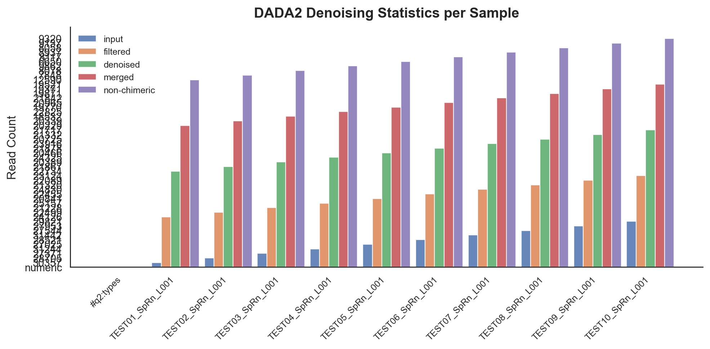

### α 多様性 — Shannon / Faith PD / Observed ASVs

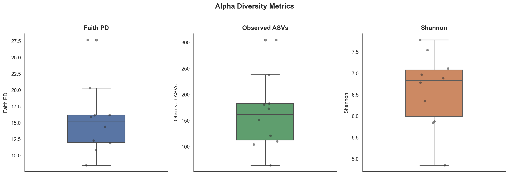

### Shannon 多様性（サンプル別ストリッププロット）

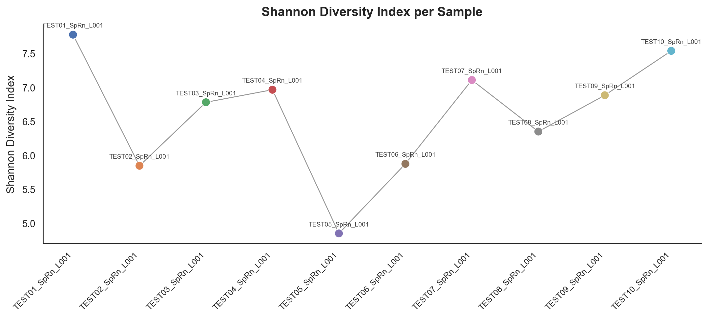

### β 多様性 — Bray-Curtis PCoA

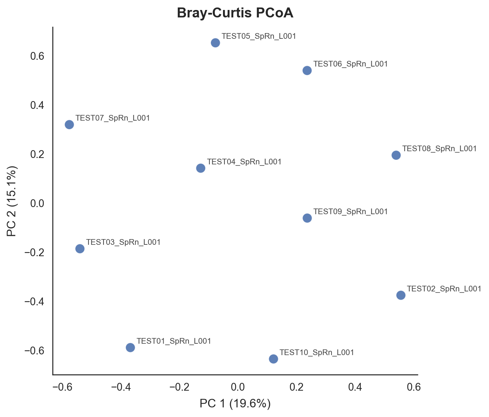

### β 多様性 — Unweighted UniFrac PCoA

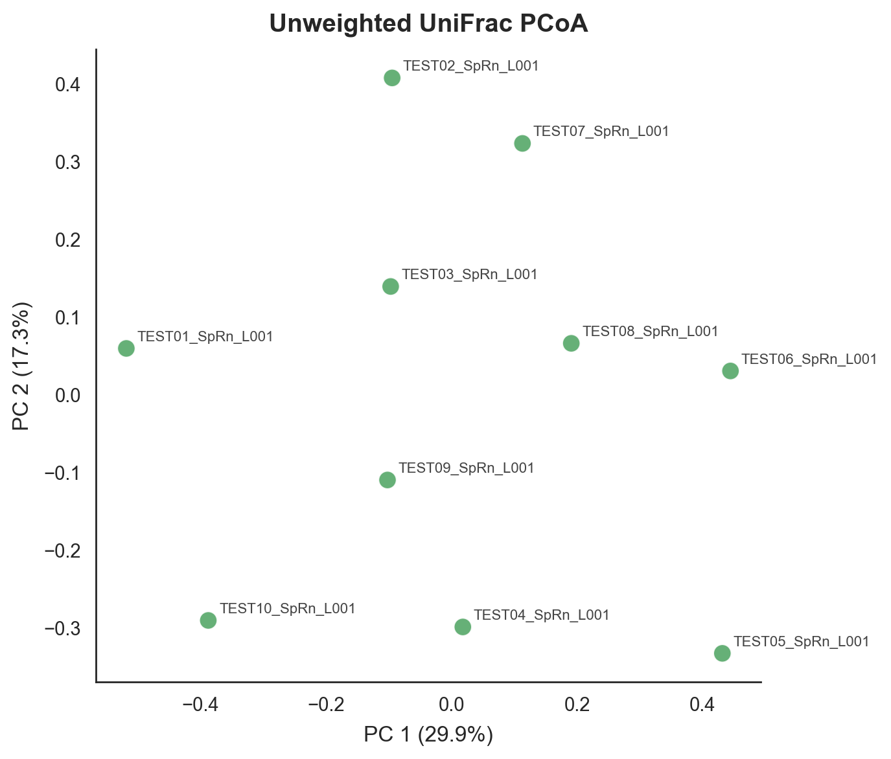

### β 多様性 — 距離行列ヒートマップ（4 指標）

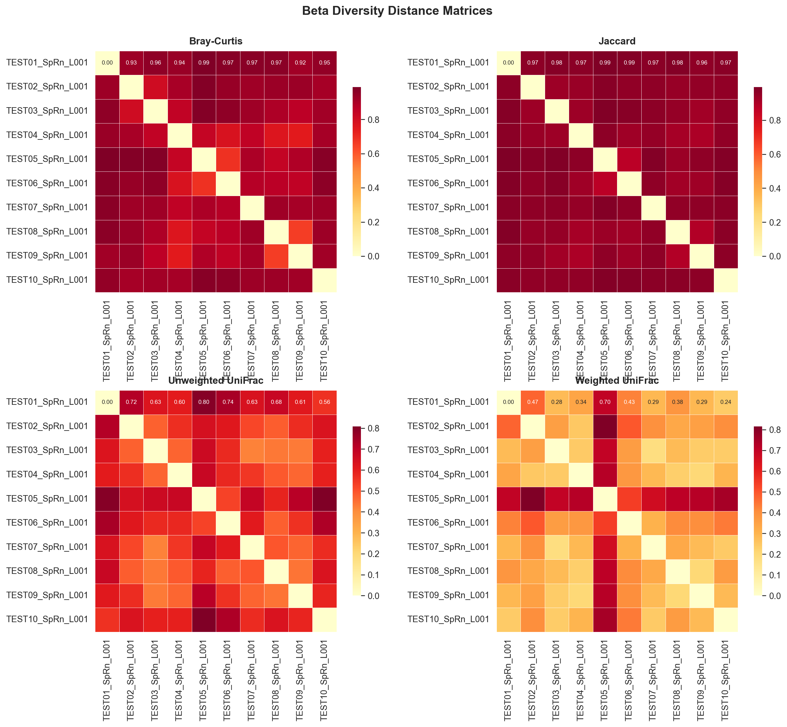

### 分類組成 — 属レベル積み上げ棒グラフ

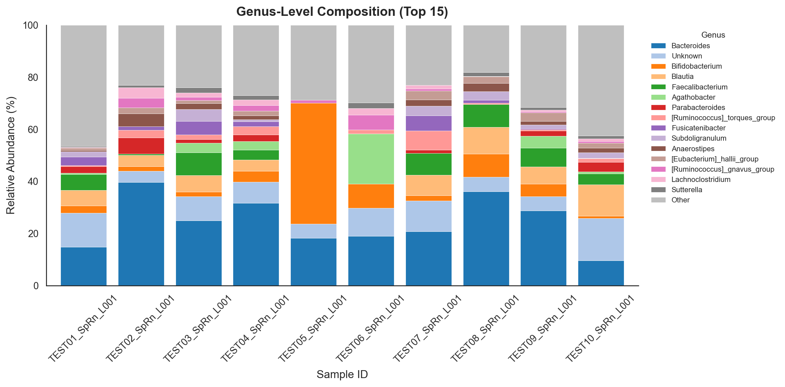

### 分類組成 — 属レベルヒートマップ

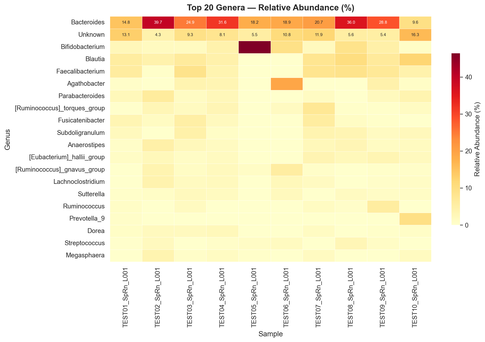

### 科レベル積み上げ棒グラフ

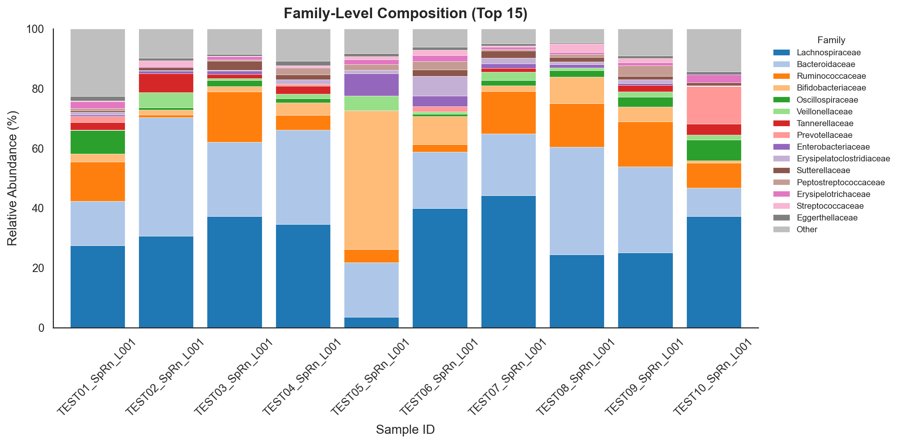

### ラレファクションカーブ

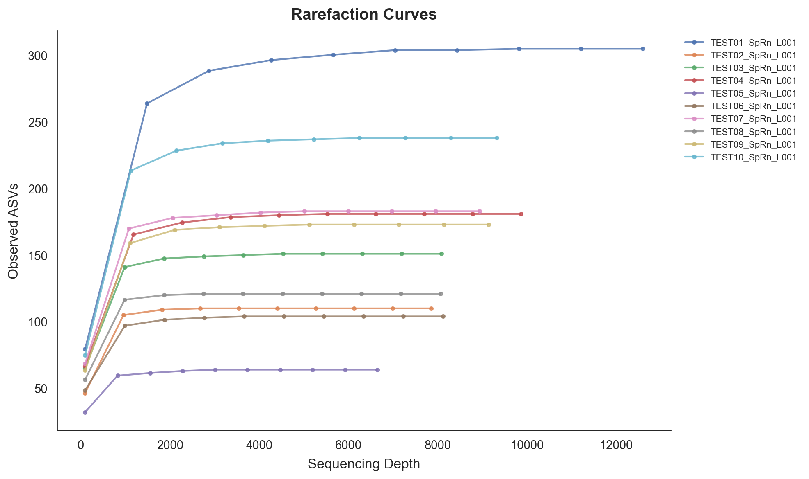

### NMDS（Bray-Curtis）

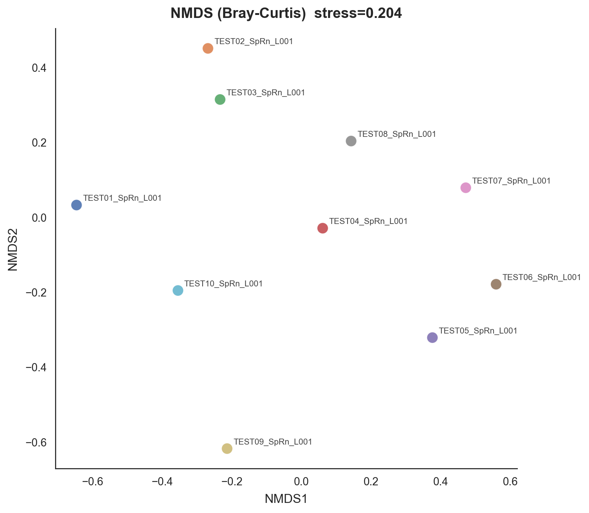

### 属間共起ネットワーク

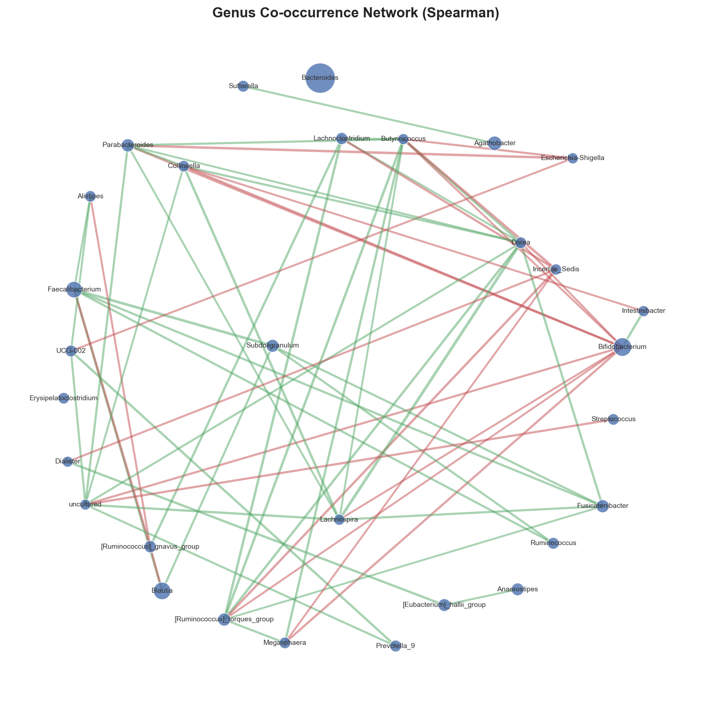

### コアマイクロバイオーム

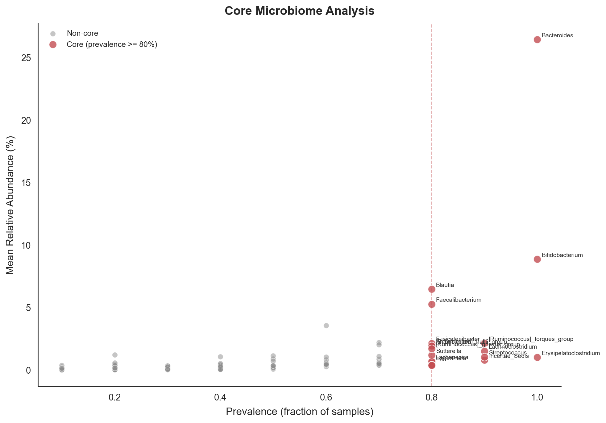

### Simpson 多様性 + Pielou 均等度

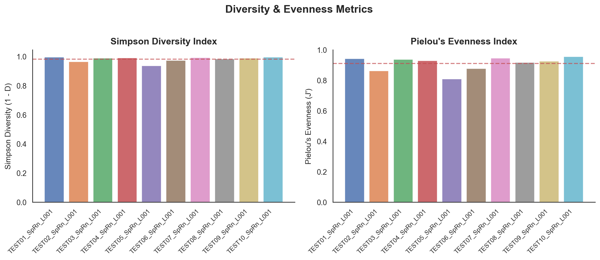

> 上記を含む全 29 図は `--auto` モードで自動生成され、HTML レポートにまとめられます。

---

## 必要なもの

| | macOS | Linux | Windows |
|---|---|---|---|
| Python | 3.9 以上 | 3.9 以上 | 3.9 以上 |
| Ollama | `setup.sh` で自動 | `setup.sh` で自動 | `setup.bat` で自動 |
| QIIME2 | conda 環境（推奨）または Docker | conda 環境または Docker Engine | Docker Desktop |
| Docker | 任意（QIIME2 conda env があれば不要） | 任意 | Docker Desktop |
| Python 解析パッケージ | QIIME2 conda env に含まれる | QIIME2 conda env に含まれる | 手動 pip |
| RAM | 8 GB 以上推奨 | 8 GB 以上推奨 | 8 GB 以上推奨 |
| ディスク | 約 10 GB（LLM + QIIME2） | 約 10 GB | 約 10 GB |

**Python 解析パッケージ**（`setup.sh` が自動インストール）:
`numpy`, `pandas`, `matplotlib`, `seaborn`, `scipy`, `scikit-learn`, `biom-format`, `networkx`, `statsmodels`

---

## インストール（3 ステップ）

### macOS

```bash
git clone https://github.com/Rhizobium-gits/seq2pipe.git
cd seq2pipe
chmod +x setup.sh launch.sh
./setup.sh      # 初回のみ（Ollama + Python パッケージ + Docker 確認）
./launch.sh     # 起動
```

### Linux（Ubuntu / Debian / Fedora / Arch など）

```bash
git clone https://github.com/Rhizobium-gits/seq2pipe.git
cd seq2pipe
chmod +x setup.sh launch.sh
./setup.sh      # 初回のみ（Docker Engine を自動インストール）
./launch.sh     # 起動
```

> Linux の場合、`setup.sh` 完了後に `newgrp docker` または再ログインが必要な場合があります。

### Windows

```
1. git clone https://github.com/Rhizobium-gits/seq2pipe.git
2. seq2pipe フォルダを開く
3. setup.bat をダブルクリック（初回のみ）
4. launch.bat をダブルクリックして起動
```

PowerShell を使う場合:

```powershell
Set-ExecutionPolicy -Scope CurrentUser -ExecutionPolicy RemoteSigned
.\setup.ps1   # 初回のみ
.\launch.ps1  # 起動
```

Windows の Python 解析パッケージは手動でインストールしてください:

```powershell
pip install numpy pandas matplotlib seaborn scipy scikit-learn biom-format networkx statsmodels
```

---

## 起動方法

```bash
./launch.sh     # macOS / Linux
.\launch.bat    # Windows
```

起動すると言語選択（日本語 / English）の後、対話型ターミナルセッションが始まります。

---

## 使い方

### モード 1 — 自然言語でリクエスト（指定解析）

```
$ ./launch.sh --fastq-dir ~/input

やりたい解析を入力: Shannon 多様性をグループ別に violin plot で比較

[list_files]  エクスポートファイル一覧を確認
[read_file]   alpha/shannon_vector.tsv の列名を確認
[write_file]  analysis.py を生成
[run_python]  EXIT CODE: 0 → figures/shannon_violin.png 保存

✅ 解析完了！

  ✏️  振り返り・修正モード
  生成された図に対して自然言語で修正を指示できます。
  例: 「積み上げ棒グラフの凡例を外に出して」
      「PCoA の点を大きくして、サンプル名を表示して」
      「色盲対応のパレットに変えて」
  📄 レポート出力:
      HTML: 「レポート」と入力
      PDF:  「PDFレポート」または「PDF」と入力
  終了: 空 Enter / quit / done

✏️  修正内容> PCoA の点を大きくしてサンプル名も表示して

[write_file] analysis.py を修正
[run_python] EXIT CODE: 0 → figures/fig10_beta_pcoa.png 更新

✏️  修正内容> PDF

📐 PDF レポートを生成しています（LaTeX）...
📐 LaTeX エンジン検出: lualatex
✅ PDF レポート生成完了！
📄 ファイル: /path/to/results/report.pdf
```

### モード 2 — 完全自律（--auto）

FASTQ ディレクトリを指定するだけで、QIIME2 パイプライン + 決定論的解析 + レポートまで自動実行します。

```bash
cd ~/seq2pipe
./launch.sh --fastq-dir ~/input --auto
```

```
  🚀 STEP 1: QIIME2 パイプライン実行中
    -> dada2 denoise-paired, phylogeny, diversity, taxonomy...
  ✅ パイプライン完了

  📊 STEP 1.5: 包括的解析（analysis.py — 29 図）
    fig01 DADA2 デノイジング統計        ✅
    fig02 シーケンシング深度            ✅
    fig03-04 α多様性                   ✅
    fig05-08 PCoA（4 指標 + 分散説明率 %）  ✅
    fig09 β多様性距離ヒートマップ        ✅
    fig10-12 ASV・リッチネス解析         ✅
    fig13-15 分類組成（属・門）          ✅
    fig16 ラレファクションカーブ          ✅
    fig17 NMDS                         ✅
    fig18 Rank-Abundance               ✅
    fig19 分類学的 Alluvial             ✅
    fig20 共起ネットワーク               ✅
    fig21 科レベル組成                   ✅
    fig22 コアマイクロバイオーム          ✅
    fig23 ボルケーノプロット（BH FDR）    ✅
    fig24 サンプルデンドログラム          ✅
    fig25 属間相関クラスターマップ        ✅
    fig26-27 綱・目レベル組成            ✅
    fig28 Simpson + Pielou 均等度       ✅
    fig29 ASV 共有パターン              ✅
  📋 解析サマリー: 5 個のパターンを検出
  ✅ 29 図を生成しました

  🤖 STEP 2: 適応型自律エージェント
    解析サマリーをもとにデータ適応型の応用解析を自動実行
    adaptive_01_outlier_investigation.png  ✅
    adaptive_02_high_variance_genera.png   ✅
    ...

  📄 STEP 3: HTML レポート生成
  ✅ レポート完了
```

### モード 4 — 研究目的駆動の自律解析（--manual-auto）

メタデータと研究の問いを指定すると、実験デザインを自動解析し、40+ 種の解析を全自動実行します。

```bash
./launch.sh --fastq-dir ~/input --manual-auto \
    --metadata metadata.tsv \
    --research-question "抗生物質投与群とコントロール群の腸内細菌叢の違い"
```

```
📋 メタデータを解析中...

Samples: 10
Columns: treatment, timepoint, subject, age
Primary grouping: 'treatment' (2 groups: antibiotic=5, control=5)
Longitudinal: timepoint column = 'timepoint'
Paired design: subject column = 'subject'

Research Question: 抗生物質投与群とコントロール群の腸内細菌叢の違い
Total steps: 41 (skipped: 2)

── Data Quality (3 steps) ──
   1. DADA2 Denoising Statistics
   2. Sequencing Depth per Sample
   3. ASV Frequency Distribution
── Taxonomic Composition (8 steps) ──
   4. Phylum-Level Composition (Stacked Bar)
   5. Genus-Level Composition (Stacked Bar)
   ...
── Alpha Diversity (5 steps) ──
  12. Alpha Diversity Comparison (Multi-Metric)
  13. Alpha Diversity Raincloud Plots
  14. Rarefaction Curves
  15. Alpha Diversity Trajectory (Longitudinal)
  16. Alpha Diversity Effect Sizes
── Beta Diversity (9 steps) ──
  17. PCoA Ordination (All Metrics)
  18. NMDS Ordination
  19. t-SNE Visualization
  20. UMAP Ordination
  ...
── Differential Abundance (4 steps) ──
  26. Volcano Plot (Differential Abundance)
  27. MA Plot (Mean-Difference)
  28. Effect Size Forest Plot
  29. LEfSe-Style Differential Analysis
── Advanced Analysis (9 steps) ──
  30. Co-Occurrence Network
  31. Genus-Genus Correlation Heatmap
  32. UpSet Diagram (Shared/Unique Taxa)
  33. Taxonomy Alluvial / Sankey Diagram
  ...
── Publication Figures (3 steps) ──
  39. Main Figure Composite (4-Panel)
  40. Supplementary Figure Composite
  41. Statistical Results Summary Table

═══════════════════════════════════════════
  🔬 Manual-Auto Analysis: 41 steps planned
  📋 Research: 抗生物質投与群とコントロール群の腸内細菌叢の違い
═══════════════════════════════════════════

  📊 Step 1/41: DADA2 Denoising Statistics
  ✅ 成功 — 図: ['step01_dada2_stats_main.png']

  📊 Step 2/41: Sequencing Depth per Sample
  ✅ 成功 — 図: ['step02_read_depth_main.png']
  ...

═══════════════════════════════════════════
  🏁 Manual-Auto Analysis Complete
  ✅ Completed: 39/41
  ❌ Failed:    2/41
  ⏭  Skipped:   2
  📊 Total figures: 52
═══════════════════════════════════════════
```

#### 実験デザイン自動検出

| 検出項目 | 方法 |
|---------|------|
| グループ列 | 優先リスト (treatment, group, condition, genotype, diet...) + カーディナリティ判定 |
| タイムポイント | カラム名パターン (timepoint, day, week, visit, dpi...) |
| 被験者列 | カラム名パターン (subject, patient, donor, mouse, animal...) |
| ペアデザイン | 被験者列 × グループ列から自動判定 |
| 不均衡デザイン | 群間サンプル数比 > 2.0 で警告 |
| 連続変数 | 数値型かつユニーク値 > 10 のカラム |

#### データ適応型の統計検定

実験デザインに基づいて最適な検定を自動選択:

| デザイン | 選択される検定 |
|---------|--------------|
| 2群・対応なし | Mann-Whitney U test |
| 2群・対応あり | Wilcoxon signed-rank test |
| 3+群・対応なし | Kruskal-Wallis + Dunn's post-hoc (Bonferroni) |
| 3+群・対応あり | Friedman test + Nemenyi post-hoc |
| β多様性群間比較 | PERMANOVA (999 permutations) |
| 多重検定補正 | Benjamini-Hochberg FDR |
| 効果量 | Cliff's delta / Hedges' g |

#### 40+ 種の解析レジストリ

| Phase | 解析手法 |
|-------|---------|
| **Data Quality** | DADA2 統計、リード深度、ASV 頻度分布 |
| **Composition** | 門/属/科積み上げ棒、ヒートマップ(clustermap)、バイオリン+ストリップ、グループ別箱ひげ図、コアマイクロバイオーム、Indicator Species |
| **Alpha Diversity** | マルチメトリクス箱ひげ図、Raincloud plot、レアファクション、効果量 Forest plot、縦断軌跡（spaghetti） |
| **Beta Diversity** | PCoA (全メトリクス+95%信頼楕円)、NMDS、t-SNE、UMAP、PCA-CLR biplot、PERMANOVA/ANOSIM、Beta Dispersion、階層クラスタリング樹形図 |
| **Differential** | Volcano plot (FDR補正)、MA plot、Forest plot (効果量)、LEfSe-style (LDA効果量)、多群 KW ヒートマップ |
| **Advanced** | 共起ネットワーク、相関 clustermap、Ternary plot (3群)、UpSet diagram、Alluvial/Sankey、Venn diagram、サンプル類似度ヒートマップ |
| **Publication** | 4パネル Main Figure、6パネル Supplementary、統計結果サマリーテーブル |

> 解析は実験デザインとデータ可用性に基づいて自動フィルタリングされます（例: 2群 → Volcano plot 有効 / Ternary plot スキップ、縦断データなし → Trajectory スキップ）

#### 検証結果

| テスト | 結果 |
|--------|------|
| インポート・レジストリ読み込み | 43 解析仕様 |
| メタデータ解析（2群・ペア・縦断） | treatment/timepoint/subject 正しく検出 |
| メタデータ解析（3群） | Ternary 追加、Volcano スキップ |
| 存在しないファイル | クラッシュせず空デザイン返却 |
| #q2:types 行スキップ | QIIME2 形式メタデータ対応 |
| プラン構築（2群、全データあり） | 41 ステップ選択、2 スキップ |
| プラン構築（3群、一部データのみ） | 25 ステップ（データ要件で絞り込み） |
| プロンプトへの実験情報埋め込み | グループ名・統計検定・メタデータパスが展開 |
| CLI --version | `seq2pipe 1.2.0` |

---

### DADA2 パラメータの自動検出

`--auto` フラグ使用時、リード長から DADA2 パラメータを自動検出します:

```bash
./launch.sh --fastq-dir ~/input --auto
# → trunc_len_f, trunc_len_r, sampling_depth を自動推定

# 手動上書きも可能
./launch.sh --fastq-dir ~/input --auto \
  --trim-left-f 20 --trim-left-r 20 \
  --trunc-len-f 260 --trunc-len-r 230
```

### 分類学的解析（`--classifier`）

SILVA 138 Naive Bayes 分類器を指定して分類学的解析を有効化できます:

```bash
# 自動探索（seq2pipe ディレクトリ内に分類器がある場合）
./launch.sh --fastq-dir ~/input --auto

# 明示的に指定
./launch.sh --fastq-dir ~/input --auto --classifier ~/silva-138-99-nb-classifier.qza
```

分類器が検出されると、QIIME2 パイプラインで分類学的解析が実行され、
`analysis.py` が属・門レベルの組成図（fig13〜fig15）を自動生成します。

### レポート出力

| 入力例 | 出力 |
|--------|------|
| `--auto` モード | HTML レポートを自動生成（STEP 3/3） |
| `レポート` / `html` | HTML レポート（図を base64 埋め込み、ブラウザで開く） |
| `PDF` / `PDFレポート` / `latex` | LaTeX → PDF レポート（lualatex/xelatex でコンパイル） |

### 生成されるファイル

```
~/seq2pipe_results/<タイムスタンプ>/
├── exported/                 ← QIIME2 エクスポートデータ
│   ├── feature-table.tsv
│   ├── taxonomy/taxonomy.tsv
│   ├── alpha/<指標>/alpha-diversity.tsv
│   ├── beta/<行列>/distance-matrix.tsv
│   └── denoising_stats/stats.tsv
├── figures/                  ← すべて PNG 形式で保存
│   ├── fig01_dada2_stats.png 〜 fig15_genus_heatmap.png  ← 基本解析 15 図
│   ├── fig16_rarefaction_curves.png 〜 fig25_genus_correlation.png  ← 拡張解析 10 図
│   ├── fig26_class_composition.png 〜 fig29_asv_overlap.png  ← 網羅的解析 4 図
│   └── adaptive_01_*.png 〜            ← LLM 適応型エージェントが生成
├── report.html               ← HTML レポート（自動生成）
├── report.tex                ← LaTeX ソース（「PDF」で生成）
└── report.pdf                ← PDF レポート（lualatex/xelatex でコンパイル）
```

---

## 対応解析一覧

### QIIME2 コア解析（STEP 1）
| 解析 | コマンド |
|---|---|
| インポート・デマルチプレックス | `qiime tools import` |
| DADA2 デノイジング | `qiime dada2 denoise-paired/single` |
| 分類（SILVA 138） | `qiime feature-classifier classify-sklearn` |
| 分類組成バーチャート | `qiime taxa barplot` |
| α・β 多様性（メタデータあり） | `qiime diversity core-metrics-phylogenetic` |
| α・β 多様性（メタデータなし） | `qiime diversity alpha` / `qiime diversity beta` など個別実行 |
| 差次解析 ANCOM-BC | `qiime composition ancombc` |

### 決定論的包括解析（STEP 1.5 — `analysis.py`、LLM 不要・29 図）
| 図番号 | 解析内容 | パッケージ |
|---|---|---|
| fig01 | DADA2 デノイジング統計 | pandas, matplotlib |
| fig02 | シーケンシング深度（サンプル別） | pandas, matplotlib |
| fig03 | α 多様性ボックスプロット（Shannon / Faith PD / Observed ASVs） | pandas, seaborn |
| fig04 | Shannon 多様性（サンプル別ストリッププロット） | pandas, seaborn |
| fig05 | Bray-Curtis PCoA（分散説明率 % 付き） | sklearn MDS, numpy |
| fig06 | Jaccard PCoA（分散説明率 % 付き） | sklearn MDS, numpy |
| fig07 | Unweighted UniFrac PCoA（分散説明率 % 付き） | sklearn MDS, numpy |
| fig08 | Weighted UniFrac PCoA（分散説明率 % 付き） | sklearn MDS, numpy |
| fig09 | β 多様性距離ヒートマップ（4 指標 2×2） | pandas, seaborn |
| fig10 | Top 30 ASV ヒートマップ | pandas, seaborn |
| fig11 | α 多様性相関プロット | pandas, matplotlib |
| fig12 | ASV リッチネス vs シーケンシング深度 | pandas, matplotlib |
| fig13 | 属レベル積み上げ棒グラフ（分類器あり） | pandas, matplotlib |
| fig14 | 門レベル積み上げ棒グラフ（分類器あり） | pandas, matplotlib |
| fig15 | 属レベルヒートマップ（分類器あり） | pandas, seaborn |
| fig16 | ラレファクションカーブ | pandas, numpy |
| fig17 | NMDS（Bray-Curtis） | sklearn MDS |
| fig18 | Rank-Abundance カーブ | pandas, matplotlib |
| fig19 | 分類学的 Alluvial プロット（門→綱→目） | matplotlib (Bézier) |
| fig20 | 属間共起ネットワーク | networkx, matplotlib |
| fig21 | 科レベル積み上げ棒グラフ | pandas, matplotlib |
| fig22 | コアマイクロバイオーム（出現頻度 vs 存在量） | pandas, matplotlib |
| fig23 | 差次的存在量ボルケーノプロット（BH FDR 補正） | scipy, matplotlib |
| fig24 | サンプルデンドログラム（UPGMA） | scipy hierarchy |
| fig25 | 属間 Spearman 相関クラスターマップ | scipy, seaborn |
| fig26 | 綱レベル積み上げ棒グラフ | pandas, matplotlib |
| fig27 | 目レベル積み上げ棒グラフ | pandas, matplotlib |
| fig28 | Simpson 多様性 + Pielou 均等度 | pandas, matplotlib |
| fig29 | サンプル間 ASV 共有パターン（UpSet 風） | itertools, matplotlib |

### Python ダウンストリーム解析（LLM コード生成エージェント — モード 1）
| 解析手法 | パッケージ |
|---|---|
| α 多様性 4 指標（Shannon / Faith PD / Evenness / Observed Features） | pandas, seaborn |
| Bray-Curtis PCoA（sklearn MDS） | pandas, sklearn |
| UniFrac PCoA（unweighted / weighted） | pandas, sklearn |
| NMDS（Bray-Curtis 非計量多次元尺度法） | pandas, sklearn |
| CLR 変換 PCA（組成データ向け主成分分析） | pandas, sklearn |
| 門・属レベル stacked bar（taxonomy あり） | pandas, seaborn |
| 属レベル heatmap（taxonomy あり） | pandas, seaborn |
| サンプル相関行列 | pandas, scipy, seaborn |
| HTML / LaTeX+PDF レポート自動生成 | report_generator.py（lualatex / xelatex） |

### 研究目的駆動の自律解析（モード 4 — `--manual-auto`、43 解析レジストリ）
| 解析手法 | カテゴリ | 条件 |
|---|---|---|
| DADA2 Denoising Statistics | Quality | denoising |
| Sequencing Depth per Sample | Quality | feature_table |
| ASV Frequency Distribution | Quality | feature_table |
| Phylum / Genus / Family Stacked Bar | Composition | feature_table + taxonomy |
| Genus Abundance Heatmap (Clustermap) | Composition | 2+群 |
| Top Genera Violin + Strip | Composition | 2+群 |
| Group-wise Genus Boxplot (FDR) | Composition | 2+群 |
| Core Microbiome Scatter | Composition | feature_table + taxonomy |
| Indicator Species Analysis | Composition | 2+群 |
| Alpha Diversity Multi-Metric Boxplot | Alpha | 2+群 |
| Alpha Diversity Raincloud Plot | Alpha | 2+群 |
| Rarefaction Curves (by group) | Alpha | feature_table |
| Alpha Diversity Trajectory | Alpha | 縦断データ |
| Alpha Effect Size Forest Plot | Alpha | 2群のみ |
| PCoA (All Metrics + 95% Ellipses) | Beta | 2+群 |
| NMDS + Convex Hulls | Beta | 2+群 |
| t-SNE | Beta | 2+群 |
| UMAP | Beta | 2+群, umap-learn |
| PCA-CLR Biplot | Beta | feature_table + taxonomy |
| PERMANOVA / ANOSIM Table | Beta | 2+群 |
| Beta Dispersion (Homogeneity) | Beta | 2+群 |
| Hierarchical Clustering Dendrogram | Beta | 2+群 |
| Beta Diversity Trajectory | Beta | 縦断データ |
| Volcano Plot (BH-FDR) | Differential | 2群のみ |
| MA Plot | Differential | 2群のみ |
| Effect Size Forest Plot (Cliff's delta) | Differential | 2群のみ |
| Multi-Group Differential Heatmap | Differential | 3+群 |
| LEfSe-Style (LDA Effect Size) | Differential | 2+群 |
| Co-Occurrence Network | Advanced | feature_table + taxonomy |
| Genus-Genus Correlation Clustermap | Advanced | feature_table + taxonomy |
| Ternary Plot | Advanced | 3群のみ |
| UpSet Diagram | Advanced | 2+群 |
| Taxonomy Alluvial / Sankey | Advanced | feature_table + taxonomy |
| Rank-Abundance Curves | Advanced | feature_table |
| Venn Diagram | Advanced | 2-3群, matplotlib-venn |
| Sample-Sample Similarity Heatmap | Advanced | 2+群 |
| Diversity vs Metadata Correlation | Advanced | alpha + 連続変数 |
| Taxa Prevalence Heatmap | Advanced | 2+群 |
| Main Figure Composite (4-Panel) | Publication | 2+群 |
| Supplementary Figure Composite (6-Panel) | Publication | feature_table + taxonomy |
| Statistical Results Summary Table | Publication | 2+群 |

---

## 環境変数

| 変数 | デフォルト | 説明 |
|---|---|---|
| `QIIME2_AI_MODEL` | `qwen2.5-coder:7b` | 使用する Ollama モデル |
| `SEQ2PIPE_AUTO_YES` | `0` | `1` にするとコマンド確認をスキップ（自律モード） |
| `SEQ2PIPE_MAX_STEPS` | `100` | エージェントループの最大ステップ数 |
| `SEQ2PIPE_PYTHON_TIMEOUT` | `600` | Python 実行のタイムアウト秒数 |
| `QIIME2_CONDA_BIN` | 自動検出 | QIIME2 conda 環境の bin ディレクトリ（手動指定用） |

```bash
# 例: 自律モードで起動（確認なし）
SEQ2PIPE_AUTO_YES=1 ./launch.sh

# 例: QIIME2 conda env を手動指定
QIIME2_CONDA_BIN=/opt/conda/envs/qiime2/bin ./launch.sh
```

---

## 使用モデル

| モデル | パラメータ数 | ディスク容量 | 推奨 RAM | 特徴 |
|---|---|---|---|---|
| `qwen2.5-coder:7b` | 7.6B | 4.7 GB | 8 GB+ | コード生成に最適（推奨） |
| `qwen2.5-coder:3b` | 3.1B | 1.9 GB | 4 GB+ | 軽量・高速、メモリ制約時に最適 |
| `llama3.2:3b` | 3.2B | 2.0 GB | 4 GB+ | 汎用・会話能力高め |
| `qwen3:8b` | 8.2B | 5.2 GB | 16 GB+ | 最高品質・推論能力も高い |
| `codellama:7b` | 6.7B | 3.8 GB | 8 GB+ | Meta のコード特化モデル |
| `deepseek-coder-v2:lite` | 2.4B | 1.5 GB | 4 GB+ | 超軽量コーディングモデル |

> **ストレージ目安**: Ollama 本体 (~500 MB) + 選択モデル (1.5〜5.2 GB) + QIIME2 conda 環境 (~3 GB) + SILVA 分類器 (~400 MB, optional) = **合計 約 6〜10 GB**

### 小型モデルへの対応（ロバストネス機能）

7B 以下の小型モデルでは Ollama の tool_calls フォーマットに非対応のことがあります。
seq2pipe は以下の多層フォールバック機構でこれを自動的に補います:

1. **`_parse_text_tool_calls`**: テキスト本文に埋め込まれた JSON をツール呼び出しとして解析（5 パターン対応）
2. **Auto-inject `run_python`**: `write_file` で .py ファイルを書いた直後、モデルが `run_python` を呼ぶのを待たずに自動実行
3. **ステップ 6 フォールバック**: ツール呼び出しループが 5 ステップ進まない場合は自動的に 1 ショット生成（`run_code_agent`）に切り替え
4. **繰り返し検出**: 同じ 50 文字チャンクが 4 回連続したら生成を打ち切り（無限ループ回避）

別のモデルを使うには:

```bash
QIIME2_AI_MODEL=qwen2.5-coder:3b ./launch.sh
```

---

## アーキテクチャ

<p align="center">
  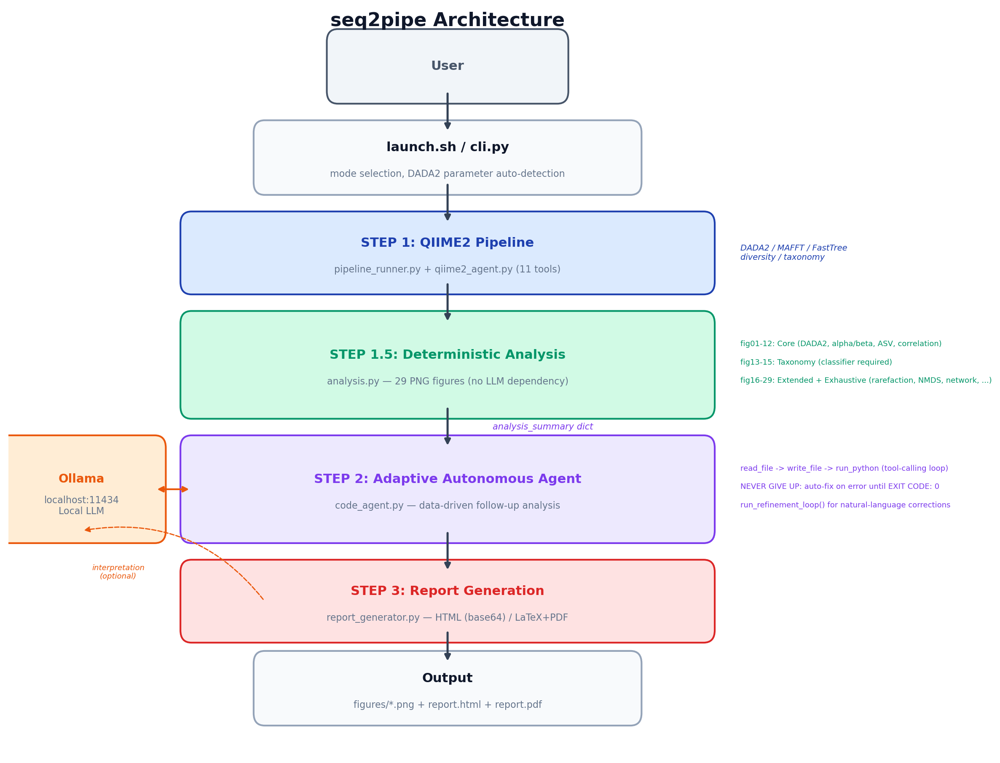
</p>

---

## トラブルシューティング

<details>
<summary>Ollama に接続できない</summary>

```bash
ollama serve
```

</details>

<details>
<summary>QIIME2 conda 環境が自動検出されない</summary>

```bash
QIIME2_CONDA_BIN=/opt/conda/envs/qiime2/bin ./launch.sh
```

自動検出される候補: `~/miniforge3/envs/qiime2*/bin`, `~/miniconda3/envs/qiime2*/bin`, `~/anaconda3/envs/qiime2*/bin`

</details>

<details>
<summary>Docker が見つからない / 起動していない</summary>

QIIME2 conda 環境が検出されている場合、Docker は不要です。

- macOS / Windows: Docker Desktop を起動してください
- Linux: `sudo systemctl start docker`

</details>

<details>
<summary>Python 解析パッケージが足りない</summary>

```bash
pip install numpy pandas matplotlib seaborn scipy scikit-learn biom-format networkx statsmodels
```

</details>

<details>
<summary>PDF レポートの LaTeX コンパイルに失敗する</summary>

`lualatex` または `xelatex` が必要です（MacTeX に含まれています）。

```bash
# macOS（推奨・約 100 MB の minimal インストール）
brew install --cask mactex-no-gui

# または MacTeX フルインストール（約 4 GB）
# https://tug.org/mactex/

# Linux（TeX Live）
sudo apt install texlive-luatex texlive-xetex texlive-lang-japanese
```

LaTeX がインストールされていない場合、`report.tex` ファイルのみ保存されます。
以下のコマンドで手動コンパイルできます:
```bash
lualatex report.tex   # 日本語対応（推奨）
xelatex  report.tex   # 代替オプション
```

</details>

<details>
<summary>図が PDF/SVG で出力される（macOS プレビューで開けない）</summary>

seq2pipe は生成された PDF/SVG を macOS 内蔵の `sips` で自動的に PNG へ変換します。
既存の PDF ファイルがある場合は以下で一括変換できます:

```bash
for f in ~/seq2pipe_results/*/figures/*.pdf; do
  sips -s format png "$f" --out "${f%.pdf}.png" && rm "$f"
done
```

</details>

<details>
<summary>モデルが重い / 応答が遅い</summary>

```bash
QIIME2_AI_MODEL=qwen2.5-coder:3b ./launch.sh
```

</details>

---

## ファイル構成

```
seq2pipe/
├── cli.py              # ターミナル エントリーポイント（虹色バナー・モード選択）
├── qiime2_agent.py     # QIIME2 パイプライン生成エージェント（11 ツール）
├── pipeline_runner.py  # QIIME2 実行ラッパー + 結果エクスポート（_Tee ログ収集）
├── analysis.py         # 決定論的包括解析モジュール（29 図、LLM 不要）
├── code_agent.py       # LLM コード生成エージェント（vibe-local 方式）
│                       #   └── run_refinement_loop()  振り返り・修正ループ
├── manual_auto_agent.py # 研究目的駆動 自律解析（43 解析レジストリ）
├── report_generator.py # HTML / LaTeX+PDF レポート生成
├── chat_agent.py       # 自律解析セッション管理（レガシー）
├── Figure/             # デモ出力図（実データ解析結果 29 図）
│   ├── fig01_dada2_stats.png 〜 fig29_asv_overlap.png
├── Paper/              # 技術レポート（TeX / PDF）
│   ├── seq2pipe_ja.tex / seq2pipe_ja.pdf
│   └── seq2pipe_en.tex / seq2pipe_en.pdf
├── launch.sh           # macOS / Linux 起動スクリプト
├── setup.sh            # macOS / Linux セットアップ
├── LICENSE             # MIT License
└── README.md           # このファイル
```

---

## Contributors

| | Name | Role |
|---|---|---|
| [@Rhizobium-gits](https://github.com/Rhizobium-gits) | Rhizobium-gits | Author |
| [@claude-bot](https://github.com/claude-bot) | Claude (Anthropic) | Co-author — design & implementation |

---

## 参考リンク

- [QIIME2 公式ドキュメント](https://docs.qiime2.org/)
- [QIIME2 View（インタラクティブ可視化）](https://view.qiime2.org)
- [QIIME2 Forum](https://forum.qiime2.org/)
- [SILVA データベース](https://www.arb-silva.de/)
- [Ollama 公式サイト](https://ollama.com/)
- [MacTeX（LaTeX for macOS）](https://tug.org/mactex/)

---

## ライセンス

- このツール: MIT License
- SILVA 138 データ: [CC BY 4.0](https://creativecommons.org/licenses/by/4.0/)
- QIIME2: BSD License

---
---

<a name="english"></a>

# English

```
 ███████╗███████╗ ██████╗ ██████╗
 ██╔════╝██╔════╝██╔═══██╗╚════██╗
 ███████╗█████╗  ██║   ██║  ██╔═╝
 ╚════██║██╔══╝  ██║▄▄ ██║ ██╔╝
 ███████║███████╗╚██████╔╝██████╗
 ╚══════╝╚══════╝ ╚══▀▀═╝ ╚═════╝
 ██████╗ ██╗██████╗ ███████╗
 ██╔══██╗██║██╔══██╗██╔════╝
 ██████╔╝██║██████╔╝█████╗
 ██╔═══╝ ██║██╔═══╝ ██╔══╝
 ██║     ██║██║     ███████╗
 ╚═╝     ╚═╝╚═╝     ╚══════╝
      sequence -> pipeline
```

> **Automate QIIME2 microbiome analysis with a local LLM — offline, no API key, open source**

[日本語](#日本語--english)

---

## What is this?

**seq2pipe** is a local AI agent that runs entirely on your own machine.
Give it your raw FASTQ data, and it automatically handles **pipeline design, execution, Python analysis, figure refinement, and report generation**.

- **Select Japanese or English at startup** — all AI responses and reports follow your choice
- Automatically checks for required Python packages (numpy / pandas / etc.) at startup
- Inspects your data structure automatically (FASTQ / metadata / existing QZA)
- Builds the right QIIME2 commands from scratch for your dataset
- Writes ready-to-run `.sh` / `.ps1` scripts
- **4 operation modes**: Prompt / Autonomous / Chat / **Research-Driven (manual-auto)**
- **`--manual-auto` mode (v1.2.0)**: Auto-parses metadata to understand experimental design → runs 40+ visualization & statistical analyses tailored to your research question
- **3-step automated analysis pipeline (`--auto` mode)**:
  - **STEP 1**: QIIME2 pipeline (DADA2 denoising, phylogeny, diversity, taxonomy)
  - **STEP 1.5**: Deterministic comprehensive analysis (`analysis.py`) — **29 publication-quality PNG figures generated reliably without LLM dependency**
  - **STEP 2**: Adaptive autonomous agent — data-driven follow-up analyses based on STEP 1.5 summary
  - **STEP 3**: Automatic HTML report generation
- **Tool-calling code generation agent (vibe-local style)**: LLM first calls `read_file` to understand column names and data format before writing code — far fewer format errors; if an error occurs, `NEVER GIVE UP` — it rewrites and retries until `EXIT CODE: 0`
- **Post-analysis refinement mode**: After analysis completes, instruct the LLM in natural language to refine figures ("change colors", "move legend outside") — code is automatically rewritten and re-executed
- Runs **Python downstream analysis** (pandas / scipy / scikit-learn / matplotlib / seaborn) on QIIME2 outputs
- **Auto-saves all figures as PNG** — PDF/SVG outputs are automatically converted via macOS built-in `sips`
- **Diversity analysis without metadata**: Alpha and beta diversity metrics computed automatically even without a metadata file
- **`--classifier` option**: Auto-discovery or explicit specification of SILVA 138 classifier for taxonomic analysis
- After analysis, HTML report is auto-generated in `--auto` mode; type **"report"** for HTML / **"PDF"** for LaTeX/PDF in chat mode

Everything runs **on your machine**. No cloud, no paid API, no internet required during analysis.

---

## Demo Output — Real Analysis Results

Actual output from seq2pipe on 10 human stool samples (TEST01-TEST10, freeze-dried, Illumina MiSeq paired-end V3-V4).
All figures were deterministically generated by `analysis.py` (STEP 1.5) as PNG.

### DADA2 Denoising Statistics


### Alpha Diversity — Shannon / Faith PD / Observed ASVs


### Shannon Diversity (Per-Sample Strip Plot)


### Beta Diversity — Bray-Curtis PCoA


### Beta Diversity — Unweighted UniFrac PCoA


### Beta Diversity — Distance Heatmaps (4 Metrics)


### Taxonomic Composition — Genus-Level Stacked Bar


### Taxonomic Composition — Genus-Level Heatmap


### Family-Level Stacked Bar


### Rarefaction Curves


### NMDS (Bray-Curtis)


### Co-occurrence Network


### Core Microbiome


### Simpson Diversity + Pielou Evenness


> All 29 figures above are auto-generated in `--auto` mode and compiled into an HTML report.

---

## Requirements

| | macOS | Linux | Windows |
|---|---|---|---|
| Python | 3.9+ | 3.9+ | 3.9+ |
| Ollama | auto via `setup.sh` | auto via `setup.sh` | auto via `setup.bat` |
| QIIME2 | conda env (recommended) or Docker | conda env or Docker Engine | Docker Desktop |
| Docker | Optional (not needed if QIIME2 conda env exists) | Optional | Docker Desktop |
| Python analysis packages | included in QIIME2 conda env | included in QIIME2 conda env | manual pip |
| RAM | 8 GB+ recommended | 8 GB+ recommended | 8 GB+ recommended |
| Disk | ~10 GB (LLM + QIIME2) | ~10 GB | ~10 GB |

**Python analysis packages** (auto-installed by `setup.sh`):
`numpy`, `pandas`, `matplotlib`, `seaborn`, `scipy`, `scikit-learn`, `biom-format`, `networkx`, `statsmodels`

---

## Install (3 steps)

### macOS

```bash
git clone https://github.com/Rhizobium-gits/seq2pipe.git
cd seq2pipe
chmod +x setup.sh launch.sh
./setup.sh      # first time only
./launch.sh     # start
```

### Linux (Ubuntu / Debian / Fedora / Arch etc.)

```bash
git clone https://github.com/Rhizobium-gits/seq2pipe.git
cd seq2pipe
chmod +x setup.sh launch.sh
./setup.sh      # first time only (auto-installs Docker Engine)
./launch.sh     # start
```

> On Linux, you may need to run `newgrp docker` or log out and back in after `setup.sh` completes.

### Windows

```
1. git clone https://github.com/Rhizobium-gits/seq2pipe.git
2. Open the seq2pipe folder
3. Double-click setup.bat (first time only)
4. Double-click launch.bat to start
```

Using PowerShell:

```powershell
Set-ExecutionPolicy -Scope CurrentUser -ExecutionPolicy RemoteSigned
.\setup.ps1   # first time only
.\launch.ps1  # start
```

Install Python packages manually on Windows:

```powershell
pip install numpy pandas matplotlib seaborn scipy scikit-learn biom-format networkx statsmodels
```

---

## Launch

```bash
./launch.sh     # macOS / Linux
.\launch.bat    # Windows
```

After launching, select your language (Japanese / English) and an interactive terminal session begins.

---

## Usage

### Mode 1 — Natural language analysis + refinement loop

```
$ ./launch.sh --fastq-dir ~/input

Enter request: Shannon diversity violin plot by group

[list_files]  scan exported directory
[read_file]   alpha/shannon_vector.tsv (check column names)
[write_file]  analysis.py
[run_python]  EXIT CODE: 0 → figures/shannon_violin.png

✅ Analysis complete!

  ✏️  Refinement mode
  Refine generated figures with natural language instructions.
  Examples: "move legend outside the plot"
            "enlarge PCoA dots and show sample names"
            "use a colorblind-friendly palette"
  📄 Reports:
      HTML: type "report"
      PDF:  type "PDF" or "latex"
  Exit: empty Enter / quit / done

✏️  Refine> enlarge dots and add sample labels to PCoA

[write_file] analysis.py (modified)
[run_python] EXIT CODE: 0 → figures/fig10_beta_pcoa.png updated

✏️  Refine> PDF

📐 Generating PDF report (LaTeX)...
📐 LaTeX engine detected: lualatex
✅ PDF report generated!
📄 File: /path/to/results/report.pdf
```

### Mode 2 — Fully autonomous (--auto)

```bash
cd ~/seq2pipe
./launch.sh --fastq-dir ~/input --auto
```

Runs the full QIIME2 pipeline + deterministic analysis (29 figures) + adaptive LLM agent + HTML report automatically.

### Mode 4 — Research-driven autonomous analysis (--manual-auto)

```bash
./launch.sh --fastq-dir ~/input --manual-auto \
    --metadata metadata.tsv \
    --research-question "抗生物質投与群とコントロール群の腸内細菌叢の違い"
```

The most comprehensive mode. Parses your metadata to understand experimental design (groups, timepoints, paired subjects), then builds a custom analysis plan:

| Phase | Analyses |
|-------|----------|
| Data Quality | DADA2 stats, read depth, ASV frequency |
| Composition | Phylum/Genus/Family stacked bars, heatmap, violin, core microbiome, indicator species |
| Alpha Diversity | Multi-metric boxplot, raincloud plot, rarefaction, effect sizes, trajectory (longitudinal) |
| Beta Diversity | PCoA (all metrics), NMDS, t-SNE, UMAP, PCA-CLR biplot, PERMANOVA/ANOSIM, beta dispersion, dendrogram |
| Differential | Volcano plot, MA plot, forest plot, LEfSe-style, multi-group heatmap |
| Advanced | Co-occurrence network, correlation clustermap, ternary plot, UpSet diagram, Sankey/alluvial, Venn diagram |
| Publication | Multi-panel composite figures, statistical summary table |

Statistical tests adapt automatically:
- 2 groups → Mann-Whitney U
- 2 groups (paired) → Wilcoxon signed-rank
- 3+ groups → Kruskal-Wallis + Dunn's post-hoc
- Beta diversity → PERMANOVA (999 permutations)
- Multiple testing → Benjamini-Hochberg FDR correction

#### Experimental design auto-detection

| Detected | Method |
|---------|--------|
| Group column | Priority list (treatment, group, condition, genotype, diet...) + cardinality check |
| Timepoint | Column name pattern (timepoint, day, week, visit, dpi...) |
| Subject column | Column name pattern (subject, patient, donor, mouse, animal...) |
| Paired design | Subject × group column cross-check |
| Unbalanced design | Warning if max/min group size ratio > 2.0 |
| Continuous variables | Numeric columns with >10 unique values |

#### Verification results

| Test | Result |
|------|--------|
| Import & registry loading | 43 analysis specs |
| Metadata parsing (2-group, paired, longitudinal) | treatment/timepoint/subject correctly detected |
| Metadata parsing (3-group) | Ternary added, Volcano skipped |
| Non-existent file | Returns empty design without crash |
| #q2:types row skip | QIIME2 format metadata supported |
| Plan building (2 groups, all data) | 41 steps selected, 2 skipped |
| Plan building (3 groups, partial data) | 25 steps (filtered by data requirements) |
| Prompt experimental context embedding | Group names, stat tests, metadata path expanded |
| CLI --version | `seq2pipe 1.2.0` |

### Taxonomic analysis (`--classifier`)

Enable taxonomic analysis by providing a SILVA 138 Naive Bayes classifier:

```bash
# Auto-discovery (if classifier exists in the seq2pipe directory)
./launch.sh --fastq-dir ~/input --auto

# Explicit path
./launch.sh --fastq-dir ~/input --auto --classifier ~/silva-138-99-nb-classifier.qza
```

When a classifier is detected, QIIME2 performs taxonomic classification, and
`analysis.py` generates genus/phylum composition figures (fig13-fig15).

### Output file structure

```
~/seq2pipe_results/<timestamp>/
├── exported/                  ← QIIME2 exported data
│   ├── feature-table.tsv
│   ├── taxonomy/taxonomy.tsv
│   ├── alpha/<metric>/alpha-diversity.tsv
│   ├── beta/<matrix>/distance-matrix.tsv
│   └── denoising_stats/stats.tsv
├── figures/                   ← all saved as PNG
│   ├── fig01_dada2_stats.png ... fig15_genus_heatmap.png  ← core 15 figures
│   ├── fig16_rarefaction_curves.png ... fig25_genus_correlation.png  ← extended 10
│   ├── fig26_class_composition.png ... fig29_asv_overlap.png  ← exhaustive 4
│   └── adaptive_01_*.png ...            ← LLM adaptive agent output
├── report.html                ← HTML report (auto-generated)
├── report.tex                 ← LaTeX source (type "PDF")
└── report.pdf                 ← PDF report (lualatex/xelatex compiled)
```

---

## Supported analyses

### QIIME2 core (STEP 1)
| Analysis | Command |
|---|---|
| Import & demultiplex | `qiime tools import` |
| DADA2 denoising | `qiime dada2 denoise-paired/single` |
| Taxonomic classification (SILVA 138) | `qiime feature-classifier classify-sklearn` |
| Composition bar chart | `qiime taxa barplot` |
| Alpha & beta diversity (with metadata) | `qiime diversity core-metrics-phylogenetic` |
| Alpha & beta diversity (without metadata) | `qiime diversity alpha` / `qiime diversity beta` (individual) |
| Differential abundance ANCOM-BC | `qiime composition ancombc` |

### Deterministic comprehensive analysis (STEP 1.5 — `analysis.py`, no LLM required, 29 figures)
| Figure | Analysis | Packages |
|---|---|---|
| fig01 | DADA2 denoising statistics | pandas, matplotlib |
| fig02 | Sequencing depth per sample | pandas, matplotlib |
| fig03 | Alpha diversity boxplots (Shannon / Faith PD / Observed ASVs) | pandas, seaborn |
| fig04 | Shannon diversity per sample (strip plot) | pandas, seaborn |
| fig05 | Bray-Curtis PCoA (with variance explained %) | sklearn MDS, numpy |
| fig06 | Jaccard PCoA (with variance explained %) | sklearn MDS, numpy |
| fig07 | Unweighted UniFrac PCoA (with variance explained %) | sklearn MDS, numpy |
| fig08 | Weighted UniFrac PCoA (with variance explained %) | sklearn MDS, numpy |
| fig09 | Beta diversity distance heatmaps (4 metrics, 2x2) | pandas, seaborn |
| fig10 | Top 30 ASV heatmap | pandas, seaborn |
| fig11 | Alpha diversity correlation plots | pandas, matplotlib |
| fig12 | ASV richness vs sequencing depth | pandas, matplotlib |
| fig13 | Genus-level stacked bar (with classifier) | pandas, matplotlib |
| fig14 | Phylum-level stacked bar (with classifier) | pandas, matplotlib |
| fig15 | Genus-level heatmap (with classifier) | pandas, seaborn |
| fig16 | Rarefaction curves | pandas, numpy |
| fig17 | NMDS (Bray-Curtis) | sklearn MDS |
| fig18 | Rank-Abundance curve | pandas, matplotlib |
| fig19 | Taxonomic alluvial plot (Phylum→Class→Order) | matplotlib (Bézier) |
| fig20 | Genus co-occurrence network | networkx, matplotlib |
| fig21 | Family-level stacked bar | pandas, matplotlib |
| fig22 | Core microbiome (prevalence vs abundance) | pandas, matplotlib |
| fig23 | Differential abundance volcano plot (BH FDR) | scipy, matplotlib |
| fig24 | Sample dendrogram (UPGMA) | scipy hierarchy |
| fig25 | Genus Spearman correlation clustermap | scipy, seaborn |
| fig26 | Class-level stacked bar | pandas, matplotlib |
| fig27 | Order-level stacked bar | pandas, matplotlib |
| fig28 | Simpson diversity + Pielou evenness | pandas, matplotlib |
| fig29 | ASV overlap pattern (UpSet-style) | itertools, matplotlib |

### Python downstream (LLM code agent — Mode 1)
| Analysis | Packages |
|---|---|
| Alpha diversity 4-panel (Shannon / Faith PD / Evenness / Observed Features) | pandas, seaborn |
| Bray-Curtis PCoA (sklearn MDS) | pandas, sklearn |
| UniFrac PCoA (unweighted / weighted) | pandas, sklearn |
| NMDS (non-metric multidimensional scaling) | pandas, sklearn |
| CLR-transformed PCA | pandas, sklearn |
| Phylum/genus stacked bar (with taxonomy) | pandas, seaborn |
| Genus-level heatmap (with taxonomy) | pandas, seaborn |
| Sample correlation matrix | pandas, scipy, seaborn |
| HTML / LaTeX+PDF report auto-generation | report_generator.py (lualatex / xelatex) |

---

## Environment variables

| Variable | Default | Description |
|---|---|---|
| `QIIME2_AI_MODEL` | `qwen2.5-coder:7b` | Ollama model to use |
| `SEQ2PIPE_AUTO_YES` | `0` | Set to `1` to skip command confirmation (autonomous mode) |
| `SEQ2PIPE_MAX_STEPS` | `100` | Maximum agent loop steps |
| `SEQ2PIPE_PYTHON_TIMEOUT` | `600` | Timeout in seconds for Python execution |
| `QIIME2_CONDA_BIN` | auto-detected | Path to QIIME2 conda env bin directory (manual override) |

---

## Models

| Model | Parameters | Disk Size | RAM Required | Description |
|---|---|---|---|---|
| `qwen2.5-coder:7b` | 7.6B | 4.7 GB | 8 GB+ | Best for code generation (recommended) |
| `qwen2.5-coder:3b` | 3.1B | 1.9 GB | 4 GB+ | Lightweight and fast, for constrained memory |
| `llama3.2:3b` | 3.2B | 2.0 GB | 4 GB+ | General purpose, good conversation |
| `qwen3:8b` | 8.2B | 5.2 GB | 16 GB+ | Highest quality, strong reasoning |
| `codellama:7b` | 6.7B | 3.8 GB | 8 GB+ | Meta's code-specialized model |
| `deepseek-coder-v2:lite` | 2.4B | 1.5 GB | 4 GB+ | Ultra-lightweight coding model |

> **Storage estimate**: Ollama (~500 MB) + selected model (1.5-5.2 GB) + QIIME2 conda env (~3 GB) + SILVA classifier (~400 MB, optional) = **total ~6-10 GB**

---

## Architecture

<p align="center">
  
</p>

---

## Troubleshooting

<details>
<summary>Cannot connect to Ollama</summary>

```bash
ollama serve
```

</details>

<details>
<summary>QIIME2 conda env not detected automatically</summary>

```bash
QIIME2_CONDA_BIN=/opt/conda/envs/qiime2/bin ./launch.sh
```

</details>

<details>
<summary>Docker not found / not running</summary>

Docker is not required if a QIIME2 conda env is detected.

- macOS / Windows: Start Docker Desktop
- Linux: `sudo systemctl start docker`

</details>

<details>
<summary>Python analysis packages missing</summary>

```bash
pip install numpy pandas matplotlib seaborn scipy scikit-learn biom-format networkx statsmodels
```

</details>

<details>
<summary>LaTeX PDF compilation fails</summary>

Install MacTeX (includes lualatex and xelatex):

```bash
# macOS — minimal install (~100 MB)
brew install --cask mactex-no-gui

# Linux
sudo apt install texlive-luatex texlive-xetex texlive-lang-japanese

# Manual compile (if auto-compile fails)
lualatex report.tex   # preferred (Japanese support)
xelatex  report.tex   # alternative
```

If no LaTeX engine is found, `report.tex` is saved for manual compilation.

</details>

<details>
<summary>Figures saved as PDF/SVG (cannot open in macOS Preview)</summary>

seq2pipe automatically converts PDF/SVG to PNG using macOS built-in `sips`.
For existing PDF files, batch-convert with:

```bash
for f in ~/seq2pipe_results/*/figures/*.pdf; do
  sips -s format png "$f" --out "${f%.pdf}.png" && rm "$f"
done
```

</details>

<details>
<summary>Model is slow / responses take too long</summary>

```bash
QIIME2_AI_MODEL=qwen2.5-coder:3b ./launch.sh
```

</details>

---

## File structure

```
seq2pipe/
├── cli.py              # Terminal entry point (rainbow banner / mode selection)
├── qiime2_agent.py     # QIIME2 pipeline generation agent (11 tools)
├── pipeline_runner.py  # QIIME2 execution wrapper + result export (_Tee logger)
├── analysis.py         # Deterministic comprehensive analysis module (29 figures, no LLM)
├── code_agent.py       # LLM code generation agent (vibe-local style)
│                       #   └── run_refinement_loop()  post-analysis refinement
├── report_generator.py # HTML and LaTeX/PDF report generation
├── chat_agent.py       # Autonomous analysis session (legacy)
├── Figure/             # Demo output figures (real data analysis results, 29 figures)
│   ├── fig01_dada2_stats.png ... fig29_asv_overlap.png
├── Paper/              # Technical report (TeX / PDF)
│   ├── seq2pipe_ja.tex / seq2pipe_ja.pdf
│   └── seq2pipe_en.tex / seq2pipe_en.pdf
├── launch.sh           # macOS / Linux launcher
├── setup.sh            # macOS / Linux setup
├── LICENSE             # MIT License
└── README.md           # This file
```

---

## Contributors

| | Name | Role |
|---|---|---|
| [@Rhizobium-gits](https://github.com/Rhizobium-gits) | Rhizobium-gits | Author |
| [@claude-bot](https://github.com/claude-bot) | Claude (Anthropic) | Co-author — design & implementation |

---

## References

- [QIIME2 Official Documentation](https://docs.qiime2.org/)
- [QIIME2 View (interactive visualization)](https://view.qiime2.org)
- [QIIME2 Forum](https://forum.qiime2.org/)
- [SILVA Database](https://www.arb-silva.de/)
- [Ollama](https://ollama.com/)
- [MacTeX (LaTeX for macOS)](https://tug.org/mactex/)

---

## Changelog

### v1.2.0 (2026-03-25)
- **`--manual-auto` モード**: 研究目的駆動の自律解析モードを追加
  - メタデータから実験デザインを自動解析（グループ・縦断・ペア設計の検出）
  - 40+ 種の可視化・統計解析レジストリから条件に合う解析を自動選択
  - データ適応型の統計検定選択（2群: Mann-Whitney, 3+群: Kruskal-Wallis, ペア: Wilcoxon）
  - 新規可視化: Raincloud plot, t-SNE, UMAP, UpSet diagram, Ternary plot, LEfSe-style, Forest plot, Alluvial/Sankey
  - PERMANOVA/ANOSIM, FDR 補正, 効果量 (Cliff's delta) を自動適用
  - `manual_auto_agent.py` (新モジュール, 700+ 行)
- CLI にモード 4 を追加（`--manual-auto --metadata meta.tsv --research-question "..."`）

### v1.1.0 (2026-03-13)
- プライマー配列を FASTQ リードから自動検出し `trim_left` を設定
- チャットモードにユーザプロンプト・メタデータのコンテキスト受け渡しを追加

### v1.0.0 (2026-03-03) — Stable Release
- 論文フォーマットを vibe-coder テクニカルレポート形式に統一
- 全機能の安定版リリース

### v0.9.0 (2026-03-02)
- 決定論的解析モジュール (`analysis.py`) で 29 図を自動生成
- HTML レポートをカテゴリ別手法・数式付きに再設計
- 16S アンプリコン / ショットガンメタゲノムの入力自動判別
- アーキテクチャ図・モデル容量情報をドキュメントに追加

### v0.8.0 (2026-02-27)
- DADA2 パラメータ（trunc_len, trim_left）を FASTQ リード長から自動検出
- 振り返り・修正モード（refinement mode）を追加
- HTML / LaTeX+PDF レポート生成機能
- PDF/SVG 図を macOS `sips` で JPEG に自動変換

### v0.7.0 (2026-02-27)
- QIIME2 + miniforge の自動インストール (`setup.sh`)
- Apple Silicon (Rosetta 2) 対応
- `--auto` フラグによる完全無人実行モード
- bash 3.x 互換性修正

### v0.6.0 (2026-02-26)
- 対話チャットモード (`chat_agent.py`) を追加
- モダン図スタイルガイドをプロンプトに組み込み
- ターミナルファースト設計へリフォーカス（Streamlit はオプション化）

### v0.5.0 (2026-02-25)
- Auto Agent モード（自律的にコード生成・実行・修正を繰り返す）
- code agent を vibe-local スタイル tool-calling ループに全面書き換え
- PCA, NMDS, 複数メトリクス α/β 多様性, レアファクションを追加
- 小規模 LLM（7B パラメータ）でも安定動作するロバスト化

### v0.4.0 (2026-02-25)
- Streamlit GUI アプリ (`app.py`) を追加
- ターミナル CLI (`cli.py`) を追加、マニフェスト起点のフローに再設計
- レインボーバナーアニメーション
- QIIME2 パイプラインと LLM コード生成を分離

### v0.3.0 (2026-02-24)
- 日本語 / 英語 UI 切り替え (i18n)
- GitHub Codespaces / Linux 対応（Ollama 起動修正）
- セッション出力ディレクトリの自動作成
- `run_qiime2_pipeline`: 単一ツールでフルパイプライン実行
- テキストフォールバックパーサー（tool-call を JSON テキストで埋め込むモデル対応）

### v0.2.0 (2026-02-23)
- Python 下流解析・図出力・TeX/PDF レポート生成
- 自律探索モード (`build_report_tex`)
- 言語選択 UI（日本語 / English）
- 7 ラウンドのバグ修正・コードレビュー
- MIT ライセンス追加

### v0.1.0 (2026-02-23) — Initial Release
- QIIME2 ローカル AI エージェント（Ollama + tool-calling）
- マニフェスト生成・パイプライン実行・可視化の基本フロー
- macOS / Windows / Linux 対応
- 日英 README・技術論文 (Paper/)

---

## License

- This tool: MIT License
- SILVA 138 data: [CC BY 4.0](https://creativecommons.org/licenses/by/4.0/)
- QIIME2: BSD License
